# Slide 1

# Slide 2

Most of the material comes from Chapter  1 of The Visual Display of Quantitative Information by Edward R. Tufte, 2nd Edition, Graphics Press, 2007.   
Graphical Excellence

Data Maps

Time Series

Space-Time Narrative Designs

Relational Graphics

History

Visual Displays  Graphical Excellence

# Slide 3

Graphical Excellence
Excellence is achieved when complex ideas are expressed with

Clarity

Precision

Efficiency

Show the data clearly.

Aim to have a quick understanding of the data trend.

Do not distort the data.

Facilitate comparisons.

Compress data in small spaces.

Show data at different scales.

# Slide 4

Graphical Excellence
Show data clearly.
Consider Anscombes Quartet:

<!-- # Slide 5 -->

<!--  -->

<!-- Graphical Excellence -->
<!-- Simple statistics fail to exhibit the data trend: -->

<!-- # Slide 6 -->

<!--  -->

<!-- Graphical Excellence -->
<!-- Showing the data clearly reveals anomalies.  -->

<!-- # Slide 7 -->

<!-- Most of the material comes from Chapter  1 of  The Visual Display of Quantitative Information by Edward R. Tufte, 2nd Edition, Graphics Press, 2007.    -->
<!-- Graphical Excellence -->

<!-- Data Maps -->

<!-- Time Series -->

<!-- Space-Time Narrative Designs -->

<!-- Relational Graphics -->

<!-- Visual Displays  Graphical Excellence   -->

<!-- # Slide 8 -->

<!--  -->

<!-- 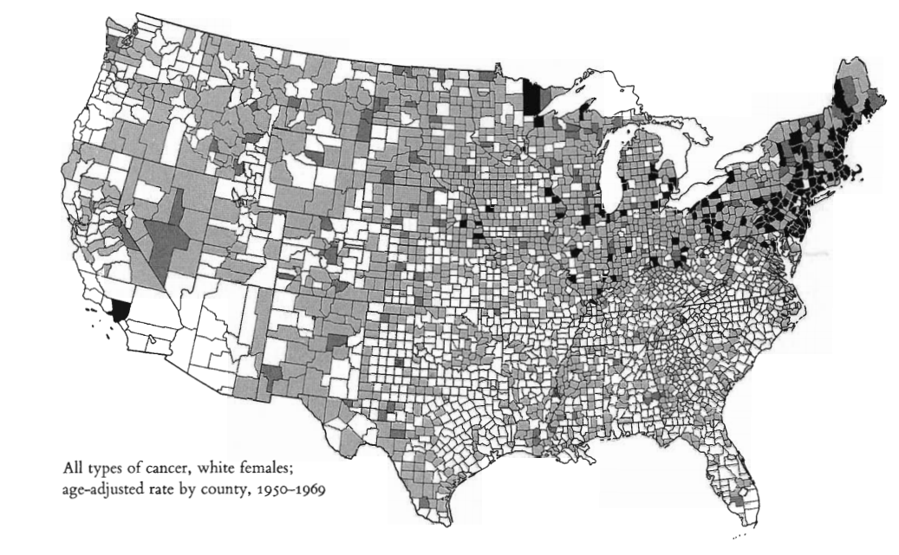 -->

<!-- Data Maps -->
<!-- Each map conveys a considerable amount of information in a small space. -->
<!-- They invite us to search for patterns and to explain their nature.    -->

<!-- # Slide 9 -->

<!-- 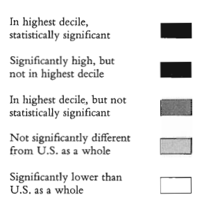 -->

<!--  -->

<!-- Data Maps -->
<!-- High death rates in the Northeast region  -->
<!-- and Great Lakes.  -->

<!-- Low death rates across central and south bands.   -->

<!-- Unusual spots.   -->

<!-- # Slide 10 -->

<!--  -->

<!-- 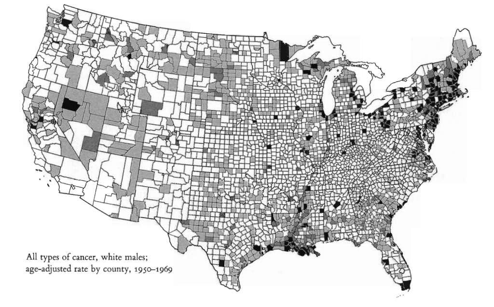 -->

<!-- Data Maps -->
<!-- Observations? -->

<!-- Explanations?   -->

<!-- # Slide 11 -->

<!--  -->

<!-- Data Maps -->
<!-- Observations? -->

<!-- High death rates in the  -->
<!-- Louisiana area. -->

<!-- Explanations?   -->

<!-- Exposure from asbestos  -->
<!-- exposure.  -->

<!-- # Slide 12 -->

<!--  -->

<!-- Data Maps -->
<!-- Shortcomings: -->

<!-- The population of each county -->
<!-- is not considered (only area).  -->

<!-- Changes across counties are  -->
<!-- abrupt (not smooth).  -->

<!-- How reliable is the data? -->
<!-- (the diagnosis may be biased).  -->

<!-- # Slide 13 -->

<!-- 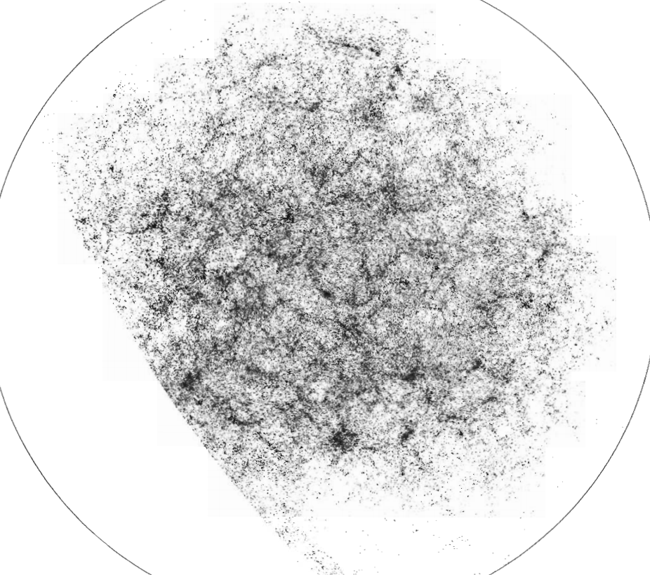 -->

<!-- Data Maps -->
<!-- Modern data maps of  -->
<!-- the Universe.   -->
<!-- Computerized cartography.  -->

<!-- Distribution of 1.3 million galaxies in the  -->
<!-- Northern Galactic hemisphere.    -->

<!-- The darker the gray tone, -->
<!-- the more galaxies in that region.  -->

<!-- Over 2 million small regions (rectangles). -->

<!-- Earth  -->
<!-- blocking -->
<!-- the view -->

<!-- Apparent filament structures need  -->
<!-- to validated statistically.  -->

<!-- # Slide 14 -->

<!-- Most of the material comes from Chapter  1 of  The Visual Display of Quantitative Information by Edward R. Tufte, 2nd Edition, Graphics Press, 2007.    -->
<!-- Graphical Excellence -->

<!-- Data Maps -->

<!-- Time Series -->

<!-- Space-Time Narrative Designs -->

<!-- Relational Graphics -->

<!-- History -->

<!-- Visual Displays  Graphical Excellence   -->

<!-- # Slide 15 -->

<!--  -->

<!-- Time Series -->
<!-- This is the most frequent type of graph design.  -->

<!-- The x-axis contains time in one of many possible units (seconds, minutes, hours, days, months, years, etc.). -->

<!-- The X-axis can be combined into multiple measurements.   -->

<!-- # Slide 16 -->

<!--  -->

<!-- Time Series -->
<!-- Radio emissions from Jupiter captured by Voyager 2 (1979). -->

<!-- Maximum intensity (magnetic pole tipped toward spacecraft) -->

<!-- Distance from the planet (Jupiter radii) -->

<!-- Time -->

<!-- Orientation of -->
<!-- Spacecraft -->

<!-- Different radio  -->
<!-- bands. -->
<!-- Useful for  -->
<!-- comparison.  -->

<!-- 453,600 samples -->
<!-- 3.6 billion bits -->
<!-- 18,900 points -->

<!-- # Slide 17 -->

<!--  -->

<!-- Time Series -->
<!-- New York City Weather Summary (1980).  -->

<!-- How much can you learn from the graph? -->

<!-- The graph tells a story -->

<!-- # Slide 18 -->

<!--  -->

<!-- Time Series -->
<!-- Mareys graphical train schedule for Paris to Lyon (1880s).   -->

<!-- Arrivals and  -->
<!-- Departures.  -->

<!-- Length of stop  -->

<!-- Focus on the slope of the lines. -->
<!-- That corresponds to the speed of the train.   -->

<!-- # Slide 19 -->

<!--  -->

<!-- Time Series -->
<!-- Mareys graphical train  -->
<!-- schedule for Paris to Lyon.  -->

<!-- Extremely fast train came in 1981.   -->

<!-- # Slide 20 -->

<!--  -->

<!-- 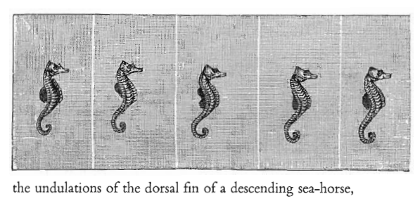 -->

<!-- Time Series -->
<!-- Time series can focus on the graphical evolution of body parts.   -->

<!-- # Slide 21 -->

<!-- 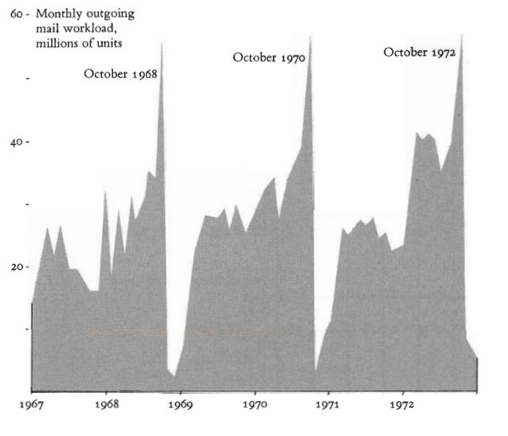 -->

<!-- Time Series -->
<!-- We have not talked about causation. Time series graphs do not necessarily convey causal explanations. -->
<!-- This can be achieved by adding more variables to the graph.   -->

<!-- But there are exceptions to simple graphs conveying causal information:   -->

<!-- Outgoing mail (millions) by incumbent representatives. -->

<!-- Representatives use the privilege of free mail to send many letters  -->
<!-- during re-election campaigns.  -->

<!-- # Slide 22 -->

<!-- Most of the material comes from Chapter  1 of  The Visual Display of Quantitative Information by Edward R. Tufte, 2nd Edition, Graphics Press, 2007.    -->
<!-- Graphical Excellence -->

<!-- Data Maps -->

<!-- Time Series -->

<!-- Space-Time Narrative Designs -->

<!-- Relational Graphics -->

<!-- History -->

<!-- Visual Displays  Graphical Excellence   -->

<!-- # Slide 23 -->

<!-- 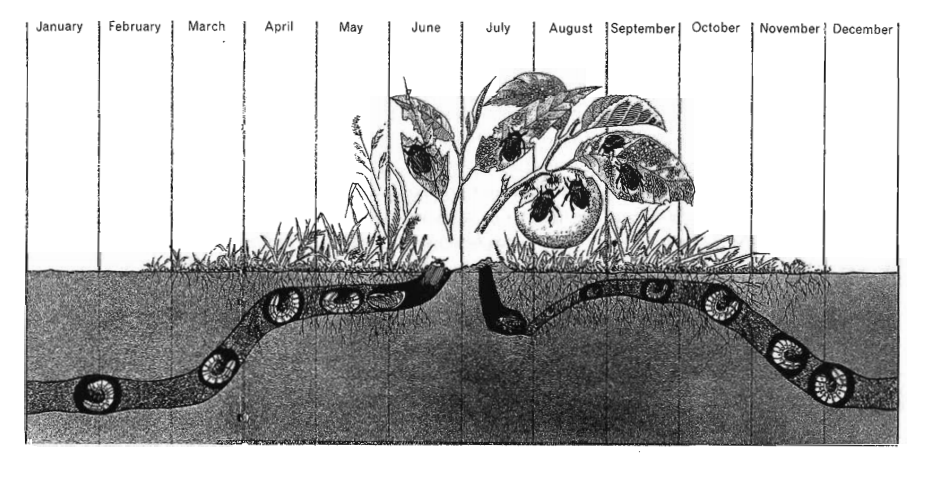 -->

<!-- Space-Time Narrative Designs -->
<!-- Time-series graphs can be enhanced by adding spatial dimensions. -->

<!-- This adds multivariate complexity that should be easy to visualize and interpret. -->

<!-- Example: Life-cycle of the Japanese beetle:  -->

<!-- # Slide 24 -->

<!-- 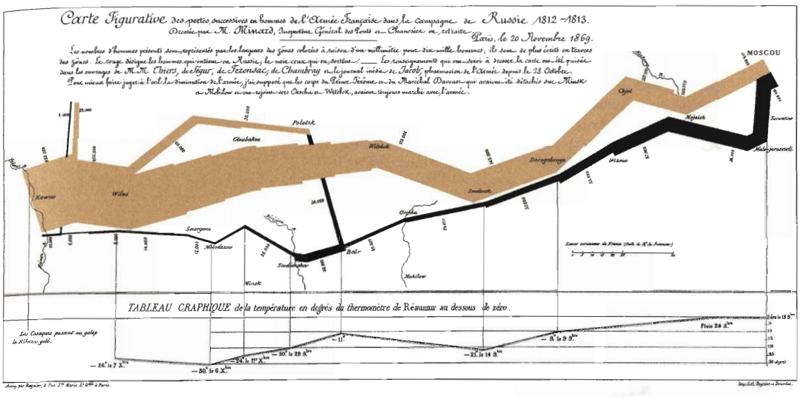 -->

<!-- Space-Time Narrative Designs -->
<!-- An all-time favorite graph shows the fate of Napoleons army in Russia (1812-1813). See the reference book for an explanation.   -->

<!-- # Slide 25 -->

<!-- 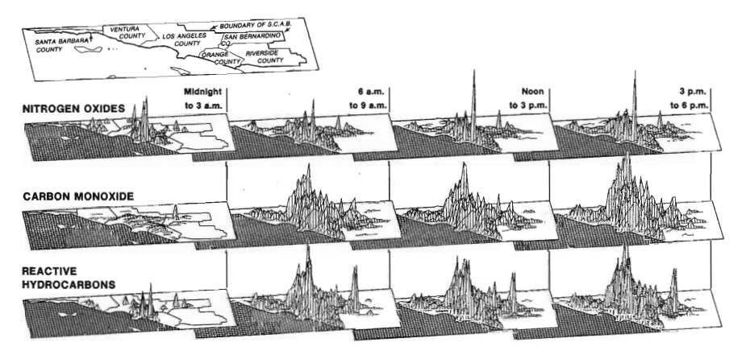 -->

<!-- Space-Time Narrative Designs -->
<!-- One more example is the levels of air pollutants in southern California during the day:     -->

<!-- # Slide 26 -->

<!-- Most of the material comes from Chapter  1 of  The Visual Display of Quantitative Information by Edward R. Tufte, 2nd Edition, Graphics Press, 2007.    -->
<!-- Graphical Excellence -->

<!-- Data Maps -->

<!-- Time Series -->

<!-- Space-Time Narrative Designs -->

<!-- Relational Graphics -->

<!-- History -->

<!-- Visual Displays  Graphical Excellence   -->

<!-- # Slide 27 -->

<!-- 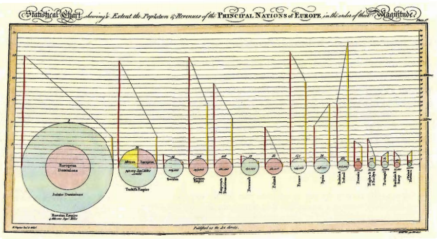 -->

<!-- Relational Graphics -->
<!-- It is similar to previous graphs, but the dimensions can differ from spatial coordinates. -->
<!-- The word relational refers to the dependence of two variables (any variables). -->

<!-- Example:    Each circle refers to a country.  -->

<!-- The size of the circle correlates  -->
<!-- with the area of the country. -->

<!-- The line on the left is the  -->
<!-- population in millions -->

<!-- The line on the right is the -->
<!-- taxes collected in millions -->
<!-- of pounds.   -->

<!-- What is important -->
<!-- is the sign of the slope -->
<!-- for every connecting line.    -->

<!-- # Slide 28 -->

<!-- 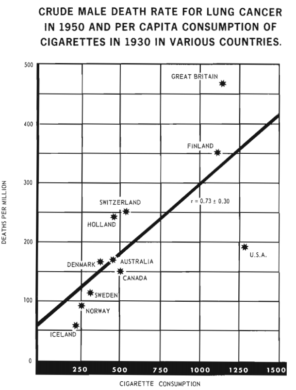 -->

<!-- Relational Graphics -->
<!-- Relational graphs are the greatest of graphical designs. -->
<!-- They help look for causal information.   -->

<!-- The relationship of lung cancer and smoking.     -->

<!-- # Slide 29 -->

<!-- 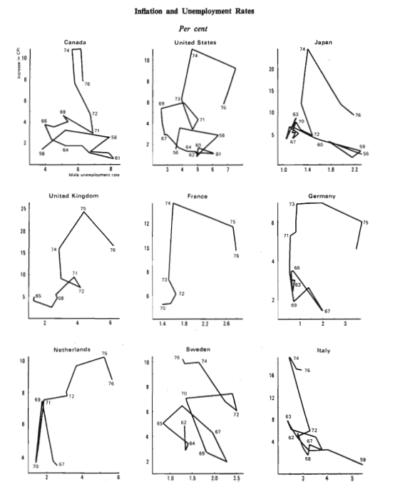 -->

<!-- Relational Graphics -->
<!-- Relational graphs are the greatest of graphical designs. -->
<!-- They help look for causal information.   -->

<!-- Is there a connection between inflation and unemployment? -->

<!-- Apparently NOT!     -->

<!-- # Slide 30 -->

<!-- 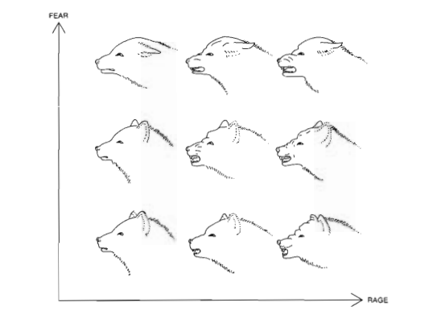 -->

<!-- Relational Graphics -->
<!-- Graphs can be very informative. -->

<!-- Data points can convey a lot of information. -->

<!-- Rage (x-axis) vs Fear (y-axis): -->

<!-- # Slide 31 -->

<!-- Most of the material comes from Chapter  1 of  The Visual Display of Quantitative Information by Edward R. Tufte, 2nd Edition, Graphics Press, 2007.    -->
<!-- Graphical Excellence -->

<!-- Data Maps -->

<!-- Time Series -->

<!-- Space-Time Narrative Designs -->

<!-- Relational Graphics -->

<!-- History -->

<!-- Visual Displays  Graphical Excellence   -->

<!-- # Slide 32 -->

<!-- History -->
<!-- First, data maps were created thousands of years ago.  -->

<!-- A significant map of the eleventh century was found in China. -->

<!-- In the sixteenth century, maps began to show similarities to modern maps.  -->

<!-- 5,000 years back -->
<!-- Geographic maps in clay tablets  -->
<!-- 11th century -->
<!-- Detailed map -->
<!--   China  -->
<!-- 16th century -->
<!-- Maps look similar -->
<!-- to modern graphs -->
<!--    Europe  -->

<!--     1750  -->
<!--     1800  -->
<!-- Graphics, time series, -->
<!-- Scatter plots, multivariate displays. -->
<!-- William Playfair  -->

<!-- 1686 Edmonds Haley -->
<!-- Map of trade winds and  -->
<!-- monsoons on a world map.  -->

<!-- # Slide 33 -->

<!-- 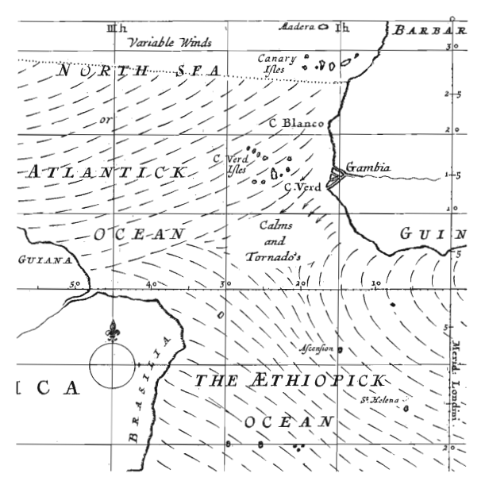 -->

<!-- History -->

<!-- Edmond Halleys 1686 chart. -->

<!-- # Slide 34 -->

<!-- 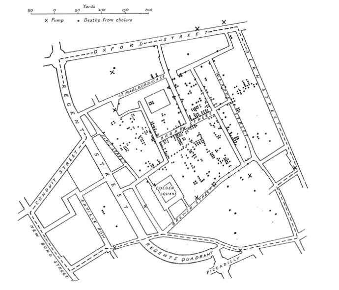 -->

<!-- History -->

<!-- 1854 -->
<!-- Location of Cholera deaths in  -->
<!-- Central London. -->
<!-- Dr. John Snow.   -->

<!-- Pumps  -->

<!-- Pump in Broad Street at the center of  -->
<!-- the outbreak.   -->

<!-- The handle of the pump was removed  -->
<!-- and the disease did not spread any more.  -->

<!-- # Slide 35 -->

<!-- 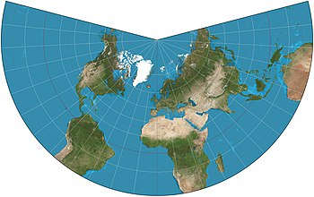 -->

<!--  -->

<!-- History -->

<!-- Great inventors of modern graphical design.  -->

<!-- Johan Heinrich Lambert -->
<!-- Swiss-German scientist and  -->
<!-- mathematician  -->
<!-- 1728-1777 -->

<!-- He pioneered the idea of map projections. -->

<!-- # Slide 36 -->

<!-- 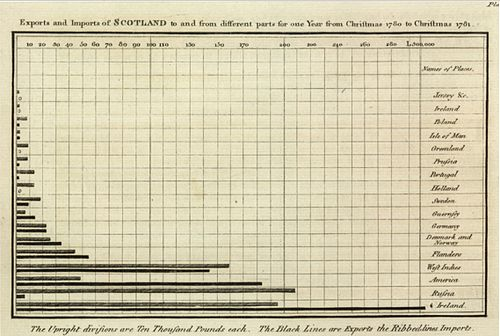 -->

<!-- 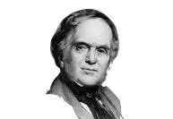 -->

<!-- History -->

<!-- Great inventors of modern graphical design.  -->

<!-- William Playfair -->
<!-- Scottish political economist  -->
<!-- 1759-1823 -->
<!-- (published the first time series economic data). -->

<!-- He created many types of charts. -->
<!-- A popular one is the bar chart.  -->

<!-- He worked as a millwright, engineer, draftsman,  -->
<!-- accountant, inventor, silversmith, merchant, investment broker, economist, statistician, pamphleteer, translator, publicist, land speculator, convict, banker, ardent royalist, editor, blackmailer, and journalist.  (extracted from Wikipedia).  -->

<!-- # Slide 37 -->

<!-- 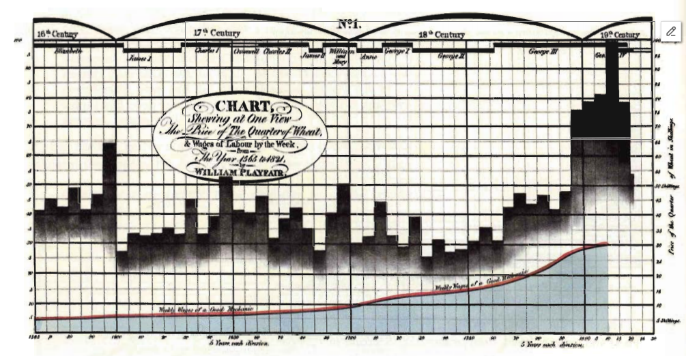 -->

<!-- History -->

<!-- William Playfair showed in this graph prices, wages, and reigns of the British monarchy.  -->
<!-- The novelty lies in combining all that information in one graph.    -->

<!-- # Slide 38 -->

<!-- 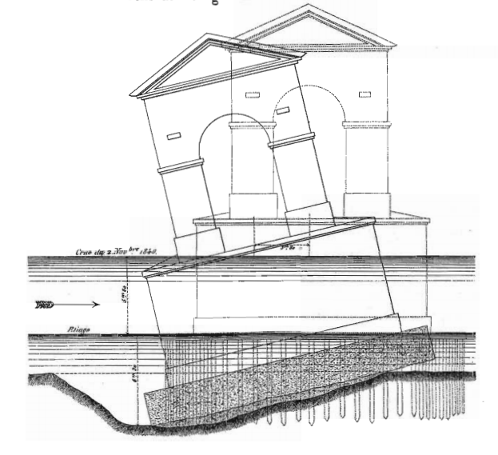 -->

<!-- Summary - Conclusions -->

<!-- Good graphs succinctly convey substantial information. -->

<!-- Coming up with a good design is challenging.  -->

<!-- Ideas must be conveyed with clarity, precision, and efficiency.  -->

