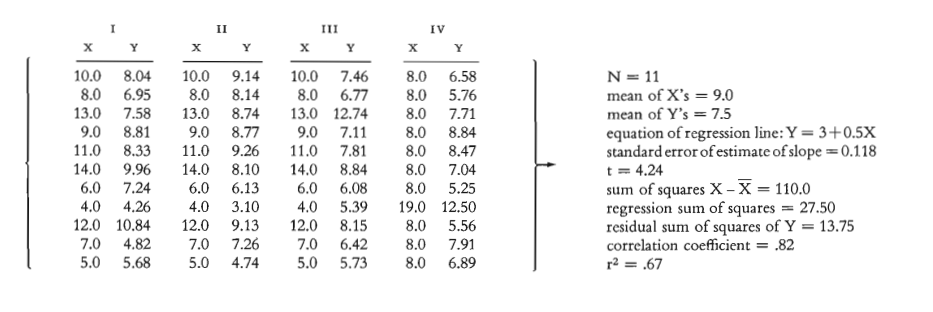
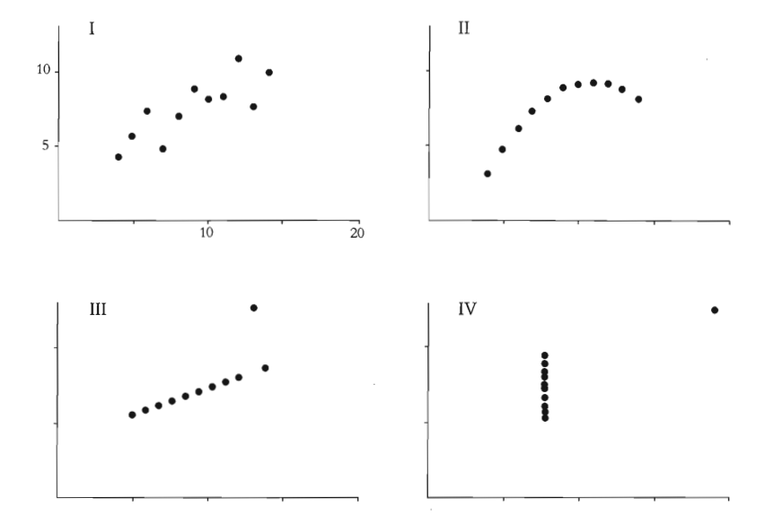
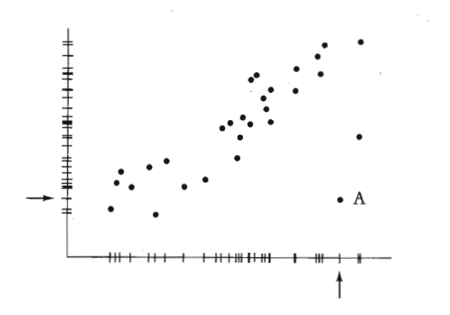
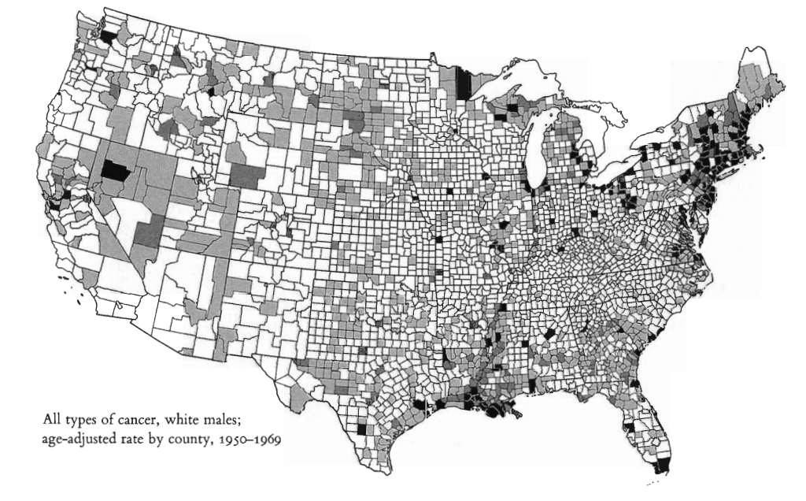
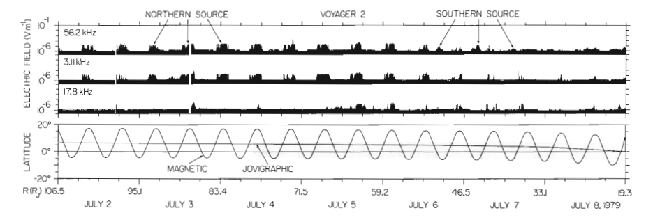
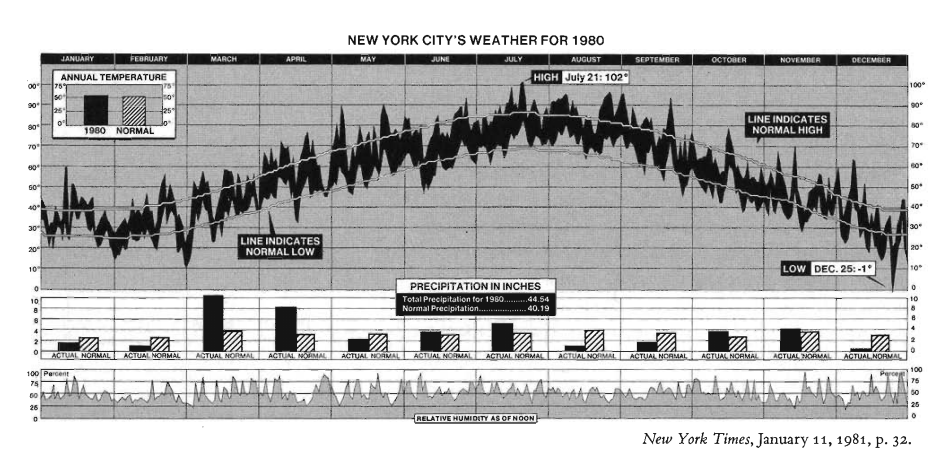
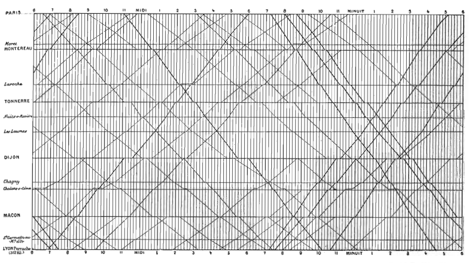
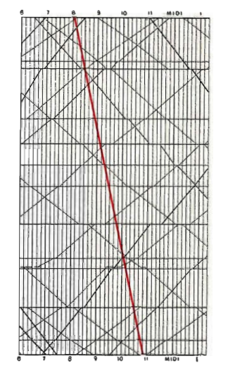

# Outline

*The Visual Display of Quantitative Information* provides a rich story of graph types and excellence including:

-   What is excellence?

-   Data maps

-   Time series

-   Space-time narrative designs

-   Relational graphics

-   Some history

# How is excellence achieved?

When complex ideas are expressed with:

-   Clarity

-   Precision

-   Efficiency

\vspace{4mm}
\pause
How do we get there?

- \textcolor{orange}{Do}: Show the data clearly, aim to have a quick understanding of the data trend, facilitate comparisons.

- \textcolor{orange}{Don't}: Distort the data, compress data in small spaces, show data at different scales.

# Why visualize? \textcolor{orange}{Anscombe's Quartet}

# Why visualize? \textcolor{orange}{Anscombe's Quartet}

{width=80%}

Simple statistics fail to exhibit the data trend!  Remember to always visualize!

# Why visualize? \textcolor{orange}{Anomaly detection}

{width=80%}

Showing the data clearly reveals anomalies.

# Data maps
\begin{minipage}{0.3\textwidth}
\centering
\includegraphics[width=\textwidth]{excellence_figs/fig_5.png}
\end{minipage}
\hfill
\begin{minipage}{0.6\textwidth}
\centering
\includegraphics[width=\textwidth]{excellence_figs/fig_4.png}
\end{minipage}

Each map conveys a large amount of information in a small space.

They invite us to search for patterns and to explain their nature.

# Data maps

\begin{minipage}{0.3\textwidth}
\centering
\includegraphics[width=\textwidth]{excellence_figs/fig_7.png}
\end{minipage}
\hfill
\begin{minipage}{0.6\textwidth}
\centering
\includegraphics[width=\textwidth]{excellence_figs/fig_6.png}
\end{minipage}

High death rates in the Northeast region and Great Lakes.

Low death rates across central and south bands.

# Data maps

\begin{minipage}{0.3\textwidth}
\centering
\includegraphics[width=\textwidth]{excellence_figs/fig_9.png}
\end{minipage}
\hfill
\begin{minipage}{0.6\textwidth}
\centering
\includegraphics[width=\textwidth]{excellence_figs/fig_10.png}
\end{minipage}

We are now looking at \textcolor{orange}{white males} ...

Observations?

Explanations?

# Data maps

High death rates in the Louisiana area. \textcolor{orange}{Asbestos exposure}

# Data maps

\textcolor{orange}{Shortcomings}:

- Visual importance of each county is tied to its geographic area (rather than, say, the number of people living in the county).

- Changes across counties are abrupt (not smooth).

- How reliable are the data? (E.g., the diagnoses may be biased).

# Modern data maps

\begin{minipage}{0.45\textwidth}
\centering
\includegraphics[width=\textwidth]{excellence_figs/fig_12.png}
\end{minipage}
\hfill
\begin{minipage}{0.5\textwidth}
\begin{itemize} \footnotesize
\item Computerized cartography of the universe
\item Distribution of 1.3 million galaxies in the Northern Galactic hemisphere.
\item The darker the gray tone, the more galaxies in that region.
\end{itemize}
\end{minipage}

# Time series

- This is the most frequent type of graph design.

- The x-axis contains time in one of many possible units (seconds, minutes, hours, days, months, years, etc.).

# Time series

- Radio emissions from Jupiter captured by Voyager 2 (1979)

- x-axis is both time and distance from Jupiter

- Top three panels are different radio bands

- Bottom panel is orientation of spacecraft

# Time series

\textcolor{orange}{New York City} weather summary (1980)

{width=95%}

How much can you learn from the graph?

The graph tells a story!

# Time series

Graphical train schedule for Paris to Lyon (1880s).

{width=90%}
\textcolor{orange}{y-axis}: Arrivals/departures, top: Paris, bottom: Lyon.

\textcolor{orange}{x-axis}: time!  Slope of line corresponds to the speed of the train.

# Time series

\centering
\includegraphics[width=0.4\textwidth]{excellence_figs/fig_17.png}

<!-- {width=40%} -->
Extremely fast train came in 1981.

# Time series

\centering
\begin{minipage}{0.55\textwidth}
\centering
\includegraphics[width=\textwidth]{excellence_figs/fig_19.png}
\end{minipage}
\hfill
\begin{minipage}{0.55\textwidth}
\centering
\includegraphics[width=\textwidth]{excellence_figs/fig_18.png}
\end{minipage}

Time series can focus on the movement of body parts.

# Time series

\begin{center}
\includegraphics[width=0.55\textwidth]{excellence_figs/fig_20.png}
\end{center}

\footnotesize
Causal information is encoded here ... how?

Outgoing mail (millions) by incumbent representatives.

Representatives use the privilege of free mail to send many letters
during re-election campaigns.

# Space-time narrative designs

\begin{minipage}{1\textwidth}
\centering
\includegraphics[width=\textwidth]{excellence_figs/fig_21.png}
\end{minipage}
\hfill
\begin{minipage}{1\textwidth}
\footnotesize
\vspace{3mm}
\begin{itemize}
  \item Time-series graphs can be enhanced by adding spatial dimensions.
  \item This adds multivariate complexity that should be easy to visualize and interpret.
  \item Example: Life-cycle of the Japanese beetle.
\end{itemize}
\end{minipage}

# Space-time narrative designs

\begin{minipage}{1\textwidth}
\centering
\includegraphics[width=\textwidth]{excellence_figs/fig_22.png}
\end{minipage}
\hfill
\begin{minipage}{1\textwidth}
\footnotesize
\vspace{3mm}
\begin{itemize}
  \item An all-time favorite graph shows the fate of Napoleon's army in Russia (1812-1813).
  \item See the reference book for an explanation.
\end{itemize}
\end{minipage}

# Space-time narrative designs

\begin{minipage}{1\textwidth}
\centering
\includegraphics[width=\textwidth]{excellence_figs/fig_23.png}
\end{minipage}
\hfill
\begin{minipage}{1\textwidth}
\footnotesize
\vspace{3mm}
One more example is the levels of air pollutants in southern California during the day.
\end{minipage}

# Relational graphics

\begin{minipage}{1\textwidth}
\centering
\includegraphics[width=\textwidth]{excellence_figs/fig_24.png}
\end{minipage}
\hfill \vspace{3mm}
\begin{minipage}{1\textwidth}
\footnotesize
\begin{itemize}
  \item Similar to previous graphs, but the dimensions can differ from spatial coordinates.
  \item "Relational" refers to the dependence of two variables (any variables).
\end{itemize}
\end{minipage}

# Relational Graphics

\begin{minipage}{1\textwidth}
\centering
\includegraphics[width=\textwidth]{excellence_figs/fig_24.png}
\end{minipage}
\hfill \vspace{3mm}
\begin{minipage}{1\textwidth}
\footnotesize
\begin{itemize}
  \item Each circle refers to a country, and the size of the circle correlates with the area of the country.
  \item The line on the left is the population in millions, and the line on the right is the taxes collected in millions of pounds.
\end{itemize}
\end{minipage}

# Relational graphics

\begin{minipage}{0.45\textwidth}
\centering
\includegraphics[width=\textwidth]{excellence_figs/fig_25.png}
\end{minipage}
\hfill
\begin{minipage}{0.5\textwidth}
\footnotesize
\begin{itemize}
  \item Relational graphs are the greatest of graphical designs.
  \item They help look for causal information.
  \item Example: The relationship of lung cancer and smoking.
\end{itemize}
\end{minipage}

# Relational graphics

\begin{minipage}{0.45\textwidth}
\centering
\includegraphics[width=\textwidth]{excellence_figs/fig_26.png}
\end{minipage}
\hfill
\begin{minipage}{0.5\textwidth}
\footnotesize
\begin{itemize}
  \item Relational graphs are the greatest of graphical designs.
  \item They help look for causal information.
  \item Is there a connection between inflation and unemployment?
  \item Apparently NOT!
\end{itemize}
\end{minipage}

# Relational graphics

\begin{minipage}{0.45\textwidth}
\centering
\includegraphics[width=\textwidth]{excellence_figs/fig_27.png}
\end{minipage}
\hfill
\begin{minipage}{0.5\textwidth}
\footnotesize
\begin{itemize}
  \item Relational Graphics
  \item Graphs can be very informative.
  \item Data points can convey a lot of information.
  \item Rage (x-axis) vs Fear (y-axis).
\end{itemize}
\end{minipage}

<!-- # Slide 31 -->

<!-- \footnotesize -->
<!-- Most of the material comes from Chapter 1 of *The Visual Display of Quantitative Information* by Edward R. Tufte, 2nd Edition, Graphics Press, 2007. -->

<!-- \begin{itemize} -->
<!--   \item Graphical Excellence -->
<!--   \item Data Maps -->
<!--   \item Time Series -->
<!--   \item Space-Time Narrative Designs -->
<!--   \item Relational Graphics -->
<!--   \item History -->
<!--   \item Visual Displays -->
<!--   \item Graphical Excellence -->
<!-- \end{itemize} -->

<!-- # Slide 32 -->

<!-- \footnotesize -->
<!-- History -->

<!-- First, data maps were created thousands of years ago. -->

<!-- A significant map of the eleventh century was found in China. -->

<!-- In the sixteenth century, maps began to show similarities to modern maps. -->

<!-- \begin{itemize} -->
<!--   \item 5,000 years back: Geographic maps in clay tablets -->
<!--   \item 11th century: Detailed map in China -->
<!--   \item 16th century: Maps look similar to modern graphs in Europe -->
<!--   \item 1750-1800: Graphics, time series, scatter plots, multivariate displays by William Playfair -->
<!--   \item 1686 Edmond Halley: Map of trade winds and monsoons on a world map. -->
<!-- \end{itemize} -->

<!-- # Slide 33 -->

<!-- \begin{minipage}{0.45\textwidth} -->
<!-- \centering -->
<!-- \includegraphics[width=\textwidth]{excellence_figs/fig_28.png} -->
<!-- \end{minipage} -->
<!-- \hfill -->
<!-- \begin{minipage}{0.5\textwidth} -->
<!-- \footnotesize -->
<!-- History -->

<!-- Edmond Halley's 1686 chart. -->
<!-- \end{minipage} -->

<!-- # Slide 34 -->

<!-- \begin{minipage}{0.45\textwidth} -->
<!-- \centering -->
<!-- \includegraphics[width=\textwidth]{excellence_figs/fig_29.png} -->
<!-- \end{minipage} -->
<!-- \hfill -->
<!-- \begin{minipage}{0.5\textwidth} -->
<!-- \footnotesize -->
<!-- History -->

<!-- 1854 -->

<!-- Location of Cholera deaths in Central London by Dr. John Snow. -->

<!-- \begin{itemize} -->
<!--   \item Pump in Broad Street at the center of the outbreak. -->
<!--   \item The handle of the pump was removed, and the disease did not spread any more. -->
<!-- \end{itemize} -->
<!-- \end{minipage} -->

<!-- # Slide 35 -->

<!-- \begin{minipage}{0.45\textwidth} -->
<!-- \centering -->
<!-- \includegraphics[width=\textwidth]{excellence_figs/fig_31.png} -->
<!-- \end{minipage} -->
<!-- \hfill -->
<!-- \begin{minipage}{0.45\textwidth} -->
<!-- \centering -->
<!-- \includegraphics[width=\textwidth]{excellence_figs/fig_30.png} -->
<!-- \end{minipage} -->
<!-- \hfill -->
<!-- \begin{minipage}{0.45\textwidth} -->
<!-- \footnotesize -->
<!-- History -->

<!-- Great inventors of modern graphical design. -->

<!-- \begin{itemize} -->
<!--   \item Johan Heinrich Lambert: Swiss-German scientist and mathematician (1728-1777) -->
<!--   \item Pioneered the idea of map projections. -->
<!-- \end{itemize} -->
<!-- \end{minipage} -->

<!-- # Slide 36 -->

<!-- \begin{minipage}{0.45\textwidth} -->
<!-- \centering -->
<!-- \includegraphics[width=\textwidth]{excellence_figs/fig_33.png} -->
<!-- \end{minipage} -->
<!-- \hfill -->
<!-- \begin{minipage}{0.45\textwidth} -->
<!-- \centering -->
<!-- \includegraphics[width=\textwidth]{excellence_figs/fig_32.png} -->
<!-- \end{minipage} -->
<!-- \hfill -->
<!-- \begin{minipage}{0.45\textwidth} -->
<!-- \footnotesize -->
<!-- History -->

<!-- Great inventors of modern graphical design. -->

<!-- \begin{itemize} -->
<!--   \item William Playfair: Scottish political economist (1759-1823) -->
<!--   \item Published the first time series economic data and created many types of charts, including the bar chart. -->
<!--   \item Diverse professional background including work as a millwright, engineer, draftsman, accountant, inventor, and more. -->
<!-- \end{itemize} -->
<!-- \end{minipage} -->

<!-- # Slide 37 -->

<!-- \begin{minipage}{0.45\textwidth} -->
<!-- \centering -->
<!-- \includegraphics[width=\textwidth]{excellence_figs/fig_34.png} -->
<!-- \end{minipage} -->
<!-- \hfill -->
<!-- \begin{minipage}{0.5\textwidth} -->
<!-- \footnotesize -->
<!-- History -->

<!-- William Playfair showed in this graph prices, wages, and reigns of the British monarchy. -->

<!-- The novelty lies in combining all that information in one graph. -->
<!-- \end{minipage} -->

# Summary

\begin{minipage}{0.45\textwidth}
\centering
\includegraphics[width=\textwidth]{excellence_figs/fig_35.png}
\end{minipage}
\hfill
\begin{minipage}{0.5\textwidth}
\footnotesize
\begin{itemize}
  \item Good graphs succinctly convey substantial information.
  \item Coming up with a good design is challenging.
  \item Ideas must be conveyed with clarity, precision, and efficiency.
  \item \textcolor{orange}{Give the viewer the greatest number of ideas in the shortest amount of time with the least ink in the smallest space.}
\end{itemize}
\end{minipage}
