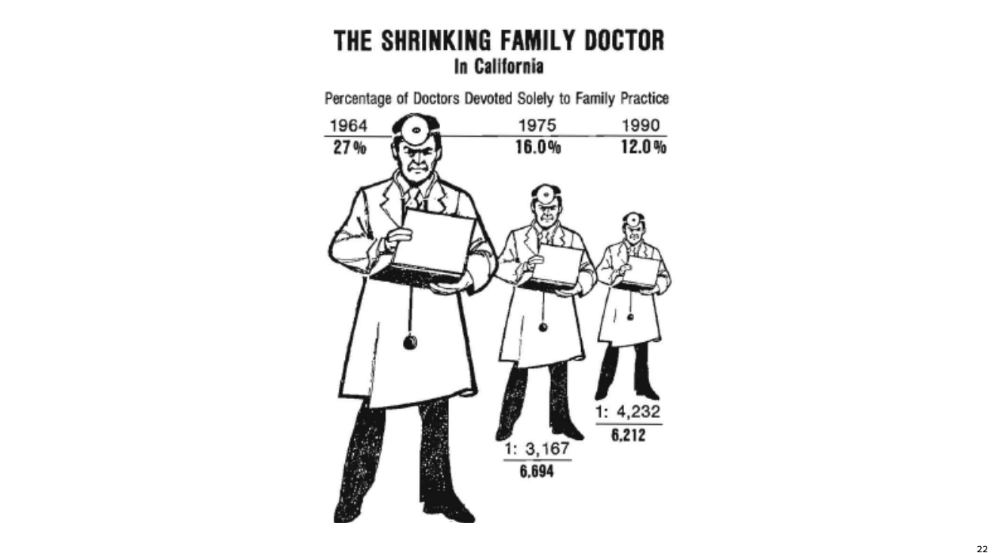
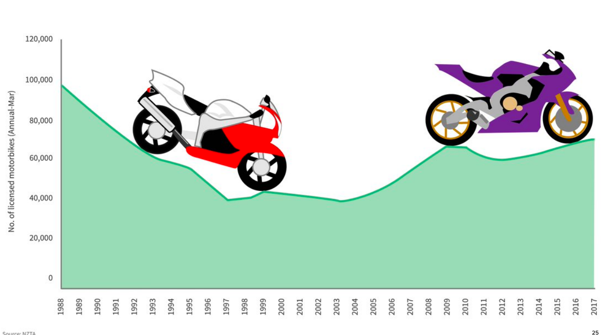
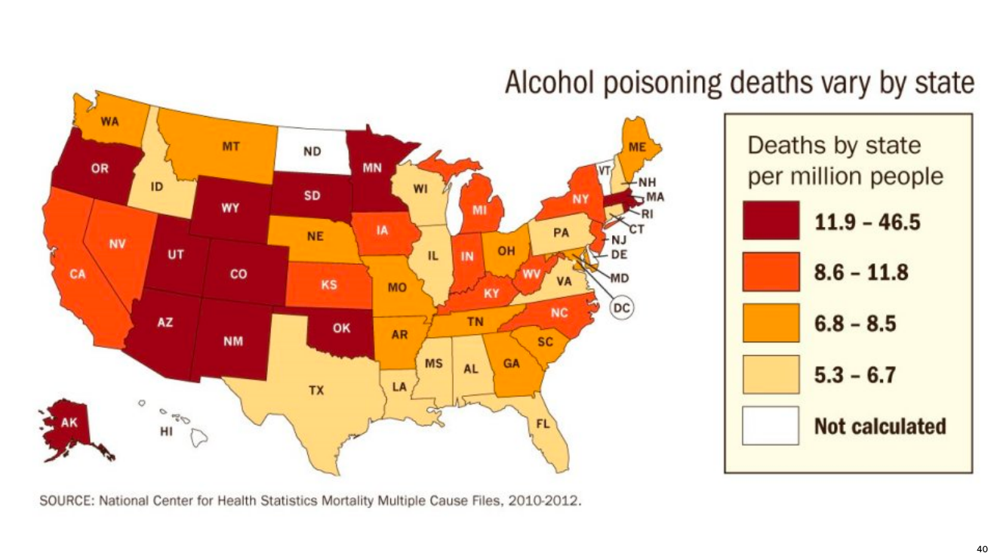
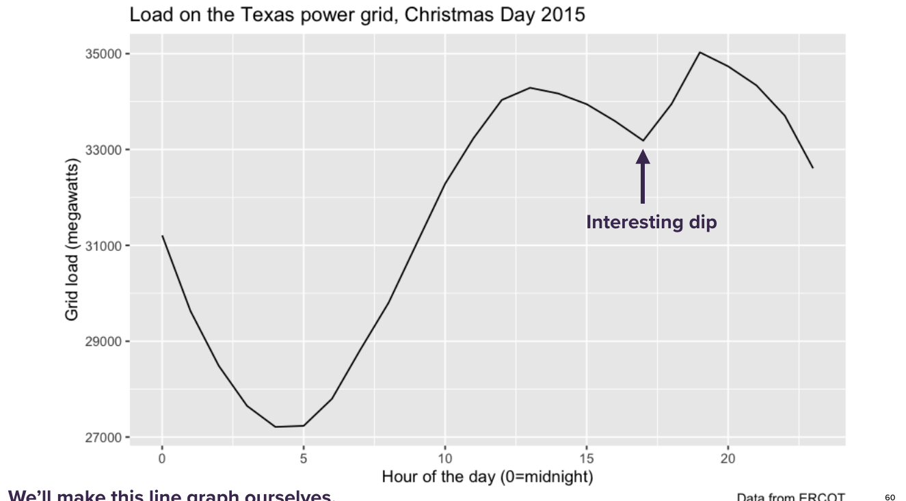
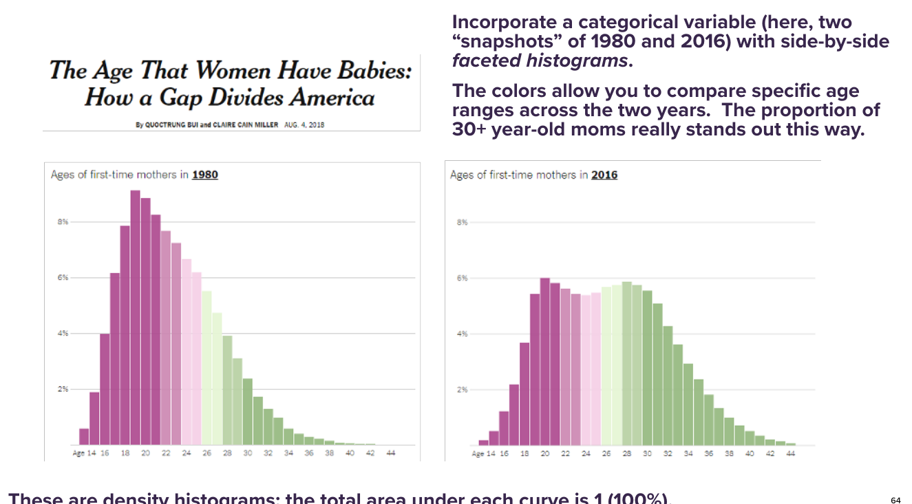

```{r setup, include=FALSE}
knitr::opts_chunk$set(echo = FALSE)
knitr::opts_chunk$set(cache = TRUE,fig.cap = " ")
```

# Outline

-   Plotting pitfalls: Hall of shame
-   Plot critiques
-   The grammar of graphics
-   The five most important plots
-   Enriching plots (color, faceting, labels, etc)

# Plotting pitfalls

-   \textcolor{orange}{Axis trickery (a.k.a. “little y lies”)}
-   Violations of basic math
-   Nearly content-free figures
-   Gratuitous chartjunk
-   Poorly chosen 3D graphics
-   Bad design choices

# 


# 


# 


# 


# 

\centering

\huge __And yet ...__

# 


#


#


# Truncating the vertical axis is sometimes ok

-   When you're trying to emphasize change, rather than relative magnitude.
-   When you're plotting data over time.
-   When zero is not a sensible baseline for comparison.

\textcolor{orange}{Bottom line} ... use your judgment; don't mislead people; watch out for "little y lies."


# Plotting pitfalls

-   Axis trickery (a.k.a. “little y lies”)
-   \textcolor{orange}{Violations of basic math}
-   Nearly content-free figures
-   Gratuitous chartjunk
-   Poorly chosen 3D graphics
-   Bad design choices


#


# 


# 


# 


# 


# Plotting pitfalls

-   Axis trickery (a.k.a. “little y lies”)
-   Violations of basic math
-   \textcolor{orange}{Nearly content-free figures}
-   Gratuitous chartjunk
-   Poorly chosen 3D graphics
-   Bad design choices


# 


# 



# 


# Plotting pitfalls

-   Axis trickery (a.k.a. “little y lies”)
-   Violations of basic math
-   Nearly content-free figures
-   \textcolor{orange}{Gratuitous chartjunk}
-   Poorly chosen 3D graphics
-   Bad design choices


#



#


#


# Plotting pitfalls

-   Axis trickery (a.k.a. “little y lies”)
-   Violations of basic math
-   Nearly content-free figures
-   Gratuitous chartjunk
-   \textcolor{orange}{Poorly chosen 3D graphics}
-   Bad design choices


#


#


#


#


# Plotting pitfalls

-   Axis trickery (a.k.a. “little y lies”)
-   Violations of basic math
-   Nearly content-free figures
-   Gratuitous chartjunk
-   Poorly chosen 3D graphics
-   \textcolor{orange}{Bad design choices}

#


#


#


#


#


#




# Your turn!

- Break in the groups of 2-3 and answer the following questions about the next figure:

\begin{enumerate}
  \item What is this figure trying to convey, and is it successful or not?
  \item If successful, what features make it so?  If unsuccessful, what would you change to make it the best graphic ever?
\end{enumerate}

#


<!-- # -->

<!--  -->

<!-- # -->

<!--  -->

<!-- # -->

<!--  -->

<!-- # -->

<!--  -->

<!-- # -->

<!--  -->

<!-- # -->

<!--  -->

<!-- # -->

<!--  -->

<!-- # -->

<!--  -->

<!-- # -->

<!--  -->

<!-- # -->

<!--  -->

<!-- # -->

<!--  -->

<!-- # -->

<!--  -->

<!-- # -->

<!--  -->

<!-- # -->

<!--  -->
