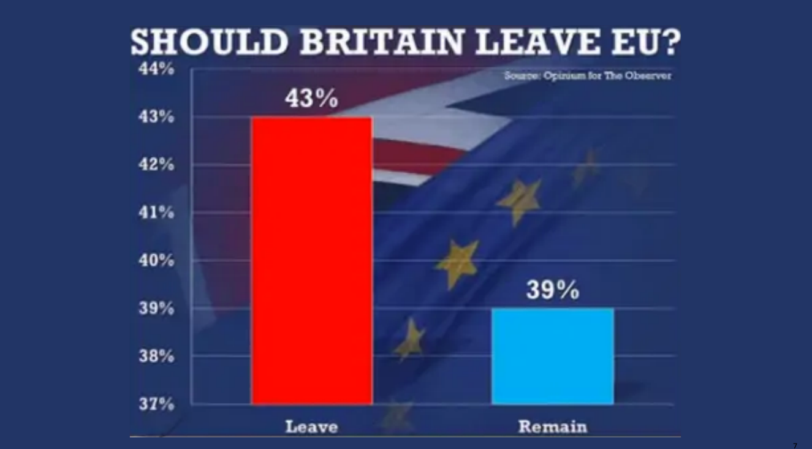
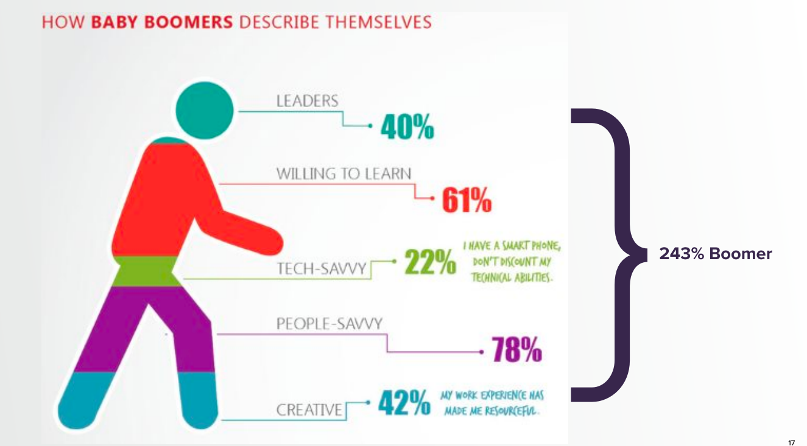
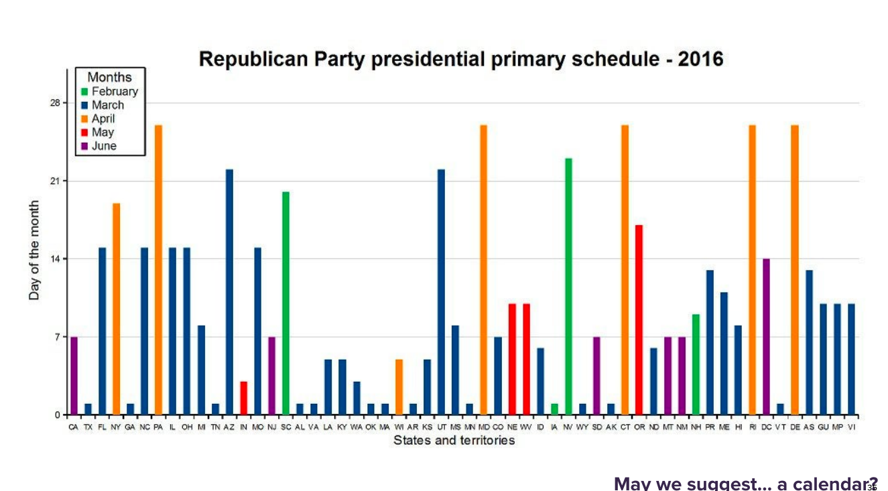
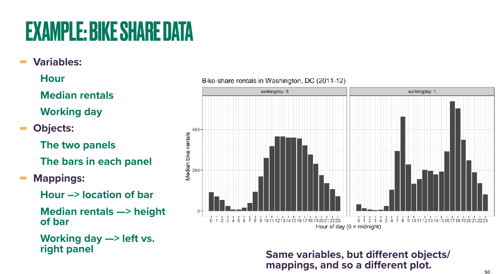
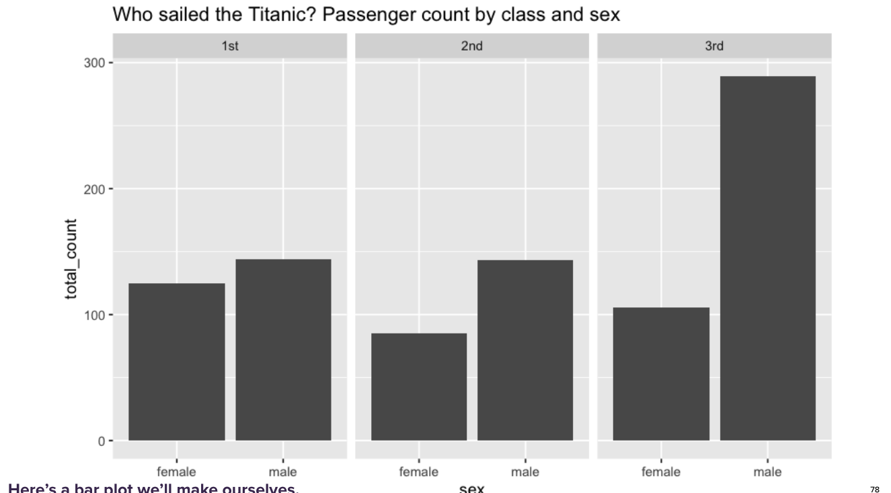

```{r setup, include=FALSE}
knitr::opts_chunk$set(echo = FALSE)
knitr::opts_chunk$set(cache = TRUE,fig.cap = " ")
```

# Outline

-   Plotting pitfalls: Hall of shame
-   Plot critiques
-   How to do better
-   The grammar of graphics \textcolor{gray}{(time permitting)}
<!-- -   The five most important plots -->
<!-- -   Enriching plots (color, faceting, labels, etc) -->

# Plotting pitfalls

-   \textcolor{orange}{Axis trickery (a.k.a. “little y lies”)}
-   Violations of basic math
-   Nearly content-free figures
-   Gratuitous chartjunk
-   Poorly chosen 3D graphics
-   Bad design choices

# 

 \begin{tikzpicture}[remember picture, overlay]
        \node[at=(current page.center)] {
            \includegraphics[width=\paperwidth, keepaspectratio]{hallofshame_figs/fig_5.png}
        };
    \end{tikzpicture}

 <!-- \centering -->
 <!--    \resizebox{\paperwidth}{\paperheight}{\includegraphics{hallofshame_figs/fig_5.png}} -->
<!--  -->

# 

\begin{tikzpicture}[remember picture, overlay]
        \node[at=(current page.center)] {
            \includegraphics[width=\paperwidth, keepaspectratio]{hallofshame_figs/fig_6.png}
        };
    \end{tikzpicture}

<!--  -->

# 

\begin{tikzpicture}[remember picture, overlay]
        \node[at=(current page.center)] {
            \includegraphics[width=\paperwidth, keepaspectratio]{hallofshame_figs/fig_7.png}
        };
    \end{tikzpicture}

<!--  -->

# 

\begin{tikzpicture}[remember picture, overlay]
        \node[at=(current page.center)] {
            \includegraphics[width=\paperwidth, keepaspectratio]{hallofshame_figs/fig_8.png}
        };
    \end{tikzpicture}

<!--  -->

# The Lie Factor

\begin{equation*}
\text{Lie Factor} = \frac{\text{size of effect shown in graphic}}{\text{size of effect in data}}
\end{equation*}

If inflating actual effect, Lie Factor will be \textcolor{orange}{greater than 1}.  If deflating actual effect, Lie Factor will be \textcolor{orange}{less than 1}.

# 

\centering

\huge __And yet ...__

# 

\begin{tikzpicture}[remember picture, overlay]
        \node[at=(current page.center)] {
            \includegraphics[width=\paperwidth, keepaspectratio]{hallofshame_figs/viz7.png}
        };
    \end{tikzpicture}


# 

\begin{tikzpicture}[remember picture, overlay]
        \node[at=(current page.center)] {
            \includegraphics[width=\paperwidth, keepaspectratio]{hallofshame_figs/viz8.png}
        };
    \end{tikzpicture}


# 

\begin{tikzpicture}[remember picture, overlay]
        \node[at=(current page.center)] {
            \includegraphics[width=\paperwidth, keepaspectratio]{hallofshame_figs/fig_10.png}
        };
    \end{tikzpicture}

<!--  -->

#

\begin{tikzpicture}[remember picture, overlay]
        \node[at=(current page.center)] {
            \includegraphics[width=\paperwidth, keepaspectratio]{hallofshame_figs/fig_11.png}
        };
    \end{tikzpicture}

<!--  -->

#

\begin{tikzpicture}[remember picture, overlay]
        \node[at=(current page.center)] {
            \includegraphics[width=\paperwidth, keepaspectratio]{hallofshame_figs/fig_12.png}
        };
    \end{tikzpicture}

<!--  -->

# Truncating the vertical axis is sometimes ok

-   When you're trying to emphasize change, rather than relative magnitude.
-   When you're plotting data over time.
-   When zero is not a sensible baseline for comparison.

\textcolor{orange}{Bottom line} ... use your judgment; don't mislead people; watch out for "little y lies."


# Plotting pitfalls

-   Axis trickery (a.k.a. “little y lies”)
-   \textcolor{orange}{Violations of basic math}
-   Nearly content-free figures
-   Gratuitous chartjunk
-   Poorly chosen 3D graphics
-   Bad design choices


#

\begin{tikzpicture}[remember picture, overlay]
        \node[at=(current page.center)] {
            \includegraphics[width=\paperwidth, keepaspectratio]{hallofshame_figs/fig_15.png}
        };
    \end{tikzpicture}

<!--  -->

# 

\begin{tikzpicture}[remember picture, overlay]
        \node[at=(current page.center)] {
            \includegraphics[width=\paperwidth, keepaspectratio]{hallofshame_figs/fig_16.png}
        };
    \end{tikzpicture}

<!--  -->

# 

\begin{tikzpicture}[remember picture, overlay]
        \node[at=(current page.center)] {
            \includegraphics[width=\paperwidth, keepaspectratio]{hallofshame_figs/fig_17.png}
        };
    \end{tikzpicture}

<!--  -->

# 

\begin{tikzpicture}[remember picture, overlay]
        \node[at=(current page.center)] {
            \includegraphics[width=\paperwidth, keepaspectratio]{hallofshame_figs/fig_18.png}
        };
    \end{tikzpicture}

<!--  -->


# 

\begin{tikzpicture}[remember picture, overlay]
        \node[at=(current page.center)] {
            \includegraphics[width=\paperwidth, keepaspectratio]{hallofshame_figs/fig_19.png}
        };
    \end{tikzpicture}

<!--  -->

# Plotting pitfalls

-   Axis trickery (a.k.a. “little y lies”)
-   Violations of basic math
-   \textcolor{orange}{Nearly content-free figures}
-   Gratuitous chartjunk
-   Poorly chosen 3D graphics
-   Bad design choices


# 

\begin{tikzpicture}[remember picture, overlay]
        \node[at=(current page.center)] {
            \includegraphics[width=\paperwidth, keepaspectratio]{hallofshame_figs/fig_21.png}
        };
    \end{tikzpicture}

<!--  -->

# 

\begin{tikzpicture}[remember picture, overlay]
        \node[at=(current page.center)] {
            \includegraphics[width=\paperwidth, keepaspectratio]{hallofshame_figs/fig_22.png}
        };
    \end{tikzpicture}

<!--  -->

# 

\begin{tikzpicture}[remember picture, overlay]
        \node[at=(current page.center)] {
            \includegraphics[width=\paperwidth, keepaspectratio]{hallofshame_figs/fig_23.png}
        };
    \end{tikzpicture}

<!--  -->

# Plotting pitfalls

-   Axis trickery (a.k.a. “little y lies”)
-   Violations of basic math
-   Nearly content-free figures
-   \textcolor{orange}{Gratuitous chartjunk}
-   Poorly chosen 3D graphics
-   Bad design choices


#

\begin{tikzpicture}[remember picture, overlay]
        \node[at=(current page.center)] {
            \includegraphics[width=\paperwidth, keepaspectratio]{hallofshame_figs/fig_25.png}
        };
    \end{tikzpicture}

<!--  -->

#

\begin{tikzpicture}[remember picture, overlay]
        \node[at=(current page.center)] {
            \includegraphics[width=\paperwidth, keepaspectratio]{hallofshame_figs/fig_26.png}
        };
    \end{tikzpicture}

<!--  -->

#

\begin{tikzpicture}[remember picture, overlay]
        \node[at=(current page.center)] {
            \includegraphics[width=\paperwidth, keepaspectratio]{hallofshame_figs/fig_27.png}
        };
    \end{tikzpicture}
    
# 

\begin{tikzpicture}[remember picture, overlay]
        \node[at=(current page.center)] {
            \includegraphics[width=\paperwidth, keepaspectratio]{hallofshame_figs/viz20.png}
        };
    \end{tikzpicture}


<!--  -->


# Plotting pitfalls

-   Axis trickery (a.k.a. “little y lies”)
-   Violations of basic math
-   Nearly content-free figures
-   Gratuitous chartjunk
-   \textcolor{orange}{Poorly chosen 3D graphics}
-   Bad design choices


#

\begin{tikzpicture}[remember picture, overlay]
        \node[at=(current page.center)] {
            \includegraphics[width=\paperwidth, keepaspectratio]{hallofshame_figs/fig_29.png}
        };
    \end{tikzpicture}

<!--  -->

#

\begin{tikzpicture}[remember picture, overlay]
        \node[at=(current page.center)] {
            \includegraphics[width=\paperwidth, keepaspectratio]{hallofshame_figs/fig_30.png}
        };
    \end{tikzpicture}

<!--  -->

#

\begin{tikzpicture}[remember picture, overlay]
        \node[at=(current page.center)] {
            \includegraphics[width=\paperwidth, keepaspectratio]{hallofshame_figs/fig_31.png}
        };
    \end{tikzpicture}

<!--  -->

#

\begin{tikzpicture}[remember picture, overlay]
        \node[at=(current page.center)] {
            \includegraphics[width=\paperwidth, keepaspectratio]{hallofshame_figs/fig_32.png}
        };
    \end{tikzpicture}

<!--  -->


# Plotting pitfalls

-   Axis trickery (a.k.a. “little y lies”)
-   Violations of basic math
-   Nearly content-free figures
-   Gratuitous chartjunk
-   Poorly chosen 3D graphics
-   \textcolor{orange}{Bad design choices}

#

\begin{tikzpicture}[remember picture, overlay]
        \node[at=(current page.center)] {
            \includegraphics[width=\paperwidth, keepaspectratio]{hallofshame_figs/fig_34.png}
        };
    \end{tikzpicture}

<!--  -->

#

\begin{tikzpicture}[remember picture, overlay]
        \node[at=(current page.center)] {
            \includegraphics[width=\paperwidth, keepaspectratio]{hallofshame_figs/fig_35.png}
        };
    \end{tikzpicture}

<!--  -->

#

\begin{tikzpicture}[remember picture, overlay]
        \node[at=(current page.center)] {
            \includegraphics[width=\paperwidth, keepaspectratio]{hallofshame_figs/fig_36.png}
        };
    \end{tikzpicture}

<!--  -->

#


\begin{tikzpicture}[remember picture, overlay]
        \node[at=(current page.center)] {
            \includegraphics[width=\paperwidth, keepaspectratio]{hallofshame_figs/fig_37.png}
        };
    \end{tikzpicture}

<!--  -->

#

\begin{tikzpicture}[remember picture, overlay]
        \node[at=(current page.center)] {
            \includegraphics[width=\paperwidth, keepaspectratio]{hallofshame_figs/fig_38.png}
        };
    \end{tikzpicture}

<!--  -->

#

\begin{tikzpicture}[remember picture, overlay]
        \node[at=(current page.center)] {
            \includegraphics[width=\paperwidth, keepaspectratio]{hallofshame_figs/fig_39.png}
        };
    \end{tikzpicture}

<!--  -->


# Your turn!

- Break in the groups of 2-3 and answer the following questions about the next figure:

\begin{itemize}
  \item What is this figure trying to convey, and is it successful or not?
  \item If successful, what features make it so?  If unsuccessful, what would you change to make it the best graphic ever?
\end{itemize}

#

\begin{tikzpicture}[remember picture, overlay]
        \node[at=(current page.center)] {
            \includegraphics[width=\paperwidth, keepaspectratio]{hallofshame_figs/fig_43.png}
        };
    \end{tikzpicture}
    
#

\begin{tikzpicture}[remember picture, overlay]
        \node[at=(current page.center)] {
            \includegraphics[height=\paperheight, keepaspectratio]{hallofshame_figs/viz31.png}
        };
    \end{tikzpicture}
    

# 

\centering

\huge __How to do better ...__

#

\begin{tikzpicture}[remember picture, overlay]
        \node[at=(current page.center)] {
            \includegraphics[width=\paperwidth, keepaspectratio]{hallofshame_figs/viz34.png}
        };
    \end{tikzpicture}

#

\begin{tikzpicture}[remember picture, overlay]
        \node[at=(current page.center)] {
            \includegraphics[width=\paperwidth, keepaspectratio]{hallofshame_figs/viz35.png}
        };
    \end{tikzpicture}
    
#

\begin{tikzpicture}[remember picture, overlay]
        \node[at=(current page.center)] {
            \includegraphics[width=\paperwidth, keepaspectratio]{hallofshame_figs/viz36.png}
        };
    \end{tikzpicture}

#

\begin{tikzpicture}[remember picture, overlay]
        \node[at=(current page.center)] {
            \includegraphics[width=\paperwidth, keepaspectratio]{hallofshame_figs/viz37.png}
        };
    \end{tikzpicture}


#

\begin{tikzpicture}[remember picture, overlay]
        \node[at=(current page.center)] {
            \includegraphics[width=\paperwidth, keepaspectratio]{hallofshame_figs/viz38.png}
        };
    \end{tikzpicture}

#

\begin{tikzpicture}[remember picture, overlay]
        \node[at=(current page.center)] {
            \includegraphics[width=\paperwidth, keepaspectratio]{hallofshame_figs/viz39.png}
        };
    \end{tikzpicture}
    
#

\begin{tikzpicture}[remember picture, overlay]
        \node[at=(current page.center)] {
            \includegraphics[width=\paperwidth, keepaspectratio]{hallofshame_figs/viz42.png}
        };
    \end{tikzpicture}
    

#

\begin{tikzpicture}[remember picture, overlay]
        \node[at=(current page.center)] {
            \includegraphics[width=\paperwidth, keepaspectratio]{hallofshame_figs/viz43.png}
        };
    \end{tikzpicture}
    
#

\begin{tikzpicture}[remember picture, overlay]
        \node[at=(current page.center)] {
            \includegraphics[width=\paperwidth, keepaspectratio]{hallofshame_figs/fig_44.png}
        };
    \end{tikzpicture}
    
#

\begin{tikzpicture}[remember picture, overlay]
        \node[at=(current page.center)] {
            \includegraphics[width=\paperwidth, keepaspectratio]{hallofshame_figs/fig_45.png}
        };
    \end{tikzpicture}
    
#

\begin{tikzpicture}[remember picture, overlay]
        \node[at=(current page.center)] {
            \includegraphics[width=\paperwidth, keepaspectratio]{hallofshame_figs/fig_46.png}
        };
    \end{tikzpicture}
    
#

\begin{tikzpicture}[remember picture, overlay]
        \node[at=(current page.center)] {
            \includegraphics[width=\paperwidth, keepaspectratio]{hallofshame_figs/fig_47.png}
        };
    \end{tikzpicture}

#

\begin{tikzpicture}[remember picture, overlay]
        \node[at=(current page.center)] {
            \includegraphics[width=\paperwidth, keepaspectratio]{hallofshame_figs/fig_48.png}
        };
    \end{tikzpicture}
    
#

\begin{tikzpicture}[remember picture, overlay]
        \node[at=(current page.center)] {
            \includegraphics[width=\paperwidth, keepaspectratio]{hallofshame_figs/fig_49.png}
        };
    \end{tikzpicture}


<!--  -->

<!-- # -->

<!--  -->

<!-- # -->

<!--  -->

<!-- # -->

<!--  -->

<!-- # -->

<!--  -->

<!-- # -->

<!--  -->

<!-- # -->

<!--  -->

<!-- # -->

<!--  -->

<!-- # -->

<!--  -->

<!-- # -->

<!--  -->

<!-- # -->

<!--  -->

<!-- # -->

<!--  -->

<!-- # -->

<!--  -->

<!-- # -->

<!--  -->

<!-- # -->

<!--  -->
