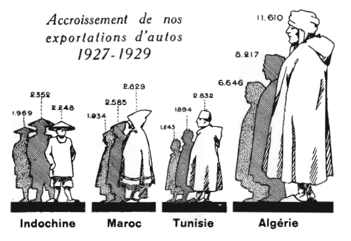
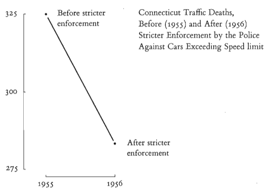
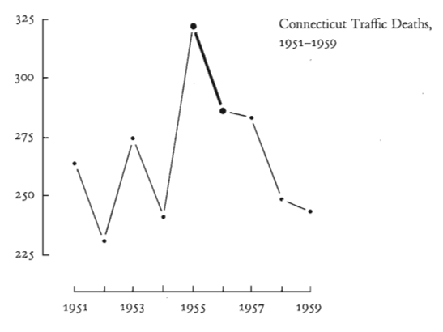

# Slide 1

Quantitative Reasoning I

Fall 2024
University of Austin  

# Slide 2

Most of the material comes from Chapter  2 of  “The Visual Display of Quantitative Information” by Edward R. Tufte, 2nd Edition, Graphics Press, 2007.   
Graphical Integrity

Lying with Graphs

The Lie Factor LF

Design vs Data Variation

The Importance of Context

Visual Displays – Graphical Integrity  

# Slide 3

Graphical Integrity
Integrity translates into telling the TRUTH with a graph.

Interestingly, most graph users in the 20th century focused on catching lies rather than analyzing data.  

 

 

# Slide 4

Graphical Integrity
Another fruitless direction was to 
decorate graphs to make them ALIVE. 

 

 

# Slide 5

Most of the material comes from Chapter  2 of  “The Visual Display of Quantitative Information” by Edward R. Tufte, 2nd Edition, Graphics Press, 2007.   
Graphical Integrity

Lying with Graphs

The Lie Factor LF

Design vs Data Variation

The Importance of Context

Visual Displays – Graphical Integrity  

# Slide 6

Lying with Graphs
Let’s start with some examples of how graphs can lie. 

 

 
Negative income
Bars begin at a value
of ~ negative $4.2 M. 

Annual Report of a Company

# Slide 7

Lying with Graphs
Let’s start with some examples of how graphs can lie. 

 

 
Periods correspond to 1976, 1977,
and six months of 1978!
The lie is repeated four times!
The intent is to conclude that there has been 
a decline in commission payments. 

# Slide 8

Lying with Graphs
Notice the disorganized nature of this graph (order. is ignored).   

 

 
Pennsylvania State Hospitals
Pittsburgh

# Slide 9

Lying with Graphs

How do humans perceive graphs?

Humans perceive images differently according to the context.

Humans perceive area growth more slowly than the actual area.  

 

 

# Slide 10

Lying with Graphs

Context is very important!

 

 

# Slide 11

Lying with Graphs

The solution is to follow two essential principles: 

 

 
1. The numbers and surface of the graph should be directly proportional.
2. We should use very detailed labels (they should eliminate all ambiguity). 

# Slide 12

Most of the material comes from Chapter  2 of  “The Visual Display of Quantitative Information” by Edward R. Tufte, 2nd Edition, Graphics Press, 2007.   
Graphical Integrity

Lying with Graphs

The Lie Factor LF

Design vs Data Variation

The Importance of Context

Visual Displays – Graphical Integrity  

# Slide 13

The Lie Factor
 
Ideally we aim at  LF = 1
If LF >  1.05 or LF < 0.95 the graph is considered distorted.
Or we can take the logarithm of LF  log LF:
Overstating errors log  LF > 0
Understating errors log LF < 0  

# Slide 14

The Lie Factor

Example of graph distortion: 

  

 

 
Change of values and change of perspective.
How can we separate the two?
Time moves
in reverse 
order along 
the road to 
exaggerate 
the effect.

# Slide 15

The Lie Factor

Try to opt for simple graphs that are clear, precise and that don’t lie.  

 

 
Baseline for comparison
(actual mpg) adds context.
Newly observed pattern:
The required standards need a 
steep improvement from ~ 1980-1983. 

# Slide 16

Most of the material comes from Chapter  2 of  “The Visual Display of Quantitative Information” by Edward R. Tufte, 2nd Edition, Graphics Press, 2007.   
Graphical Integrity

Lying with Graphs

The Lie Factor LF

Design vs Data Variation

The Importance of Context

Visual Displays – Graphical Integrity  

# Slide 17

Design vs Data Variation

There is a clear correspondence between 
graph design and data variation.

Deception takes place when that 
correspondence is ignored. 

Notice the time intervals on the x-axis here.
All intervals come in jumps of ten years,
except for the last interval.    

 

 

# Slide 18

Design vs Data Variation

Correct graph:     

 

 

# Slide 19

Design vs Data Variation

The problem lies in the way we process information.

Changes in design are innately related to changes in data. 

Important principle: 

 

 
Show data variation, not 
design variation

# Slide 20

Design vs Data Variation

Example:

 

 

This is design variation.

 

# Slide 21

Design vs Data Variation

Example:

 

 
A price of $10 is equivalent to 
0.31 squared inches. 

 
A price of $10 is equivalent to 
4.69 squared inches. 

 
The ratio between the right and left is  4.69/0.31 = 15.1 times larger on the right.  

 

# Slide 22

Design vs Data Variation

Another example:

 

 
The actual data increase of 708% is shown as 6,700% for a Lie Factor of 6800/708 = 9.5  

 

# Slide 23

Design vs Data Variation

When dealing with an item's cost or monetary value over time, adjusting for inflation is imperative.

That is because the dollar in the past was worth more than it is in the present. 

 

 

# Slide 24

Design vs Data Variation

An example of government spending: 

 

 
Multiple visual
tricks to create a 
wrong impression of 
a huge increase in spending. 

 

# Slide 25

Design vs Data Variation

An example of government spending: 

 

 
The rotation trick is eliminated.
Always choose simple informative graphs.  

 

# Slide 26

Design vs Data Variation

Adjusting for population growth and inflation leads to an accurate graph:  

 

 

Remember: 

When showing monetary value
over time, use 

deflated units and 

standardized units.   

 

 

# Slide 27

Design vs Data Variation

Another essential principle is never to use areas to display one-dimensional data.  

 

 

# Slide 28

Design vs Data Variation

The shrinking doctor. Lie factor LF = 2.8  

 

 

# Slide 29

Most of the material comes from Chapter  2 of  “The Visual Display of Quantitative Information” by Edward R. Tufte, 2nd Edition, Graphics Press, 2007.   
Graphical Integrity

Lying with Graphs

The Lie Factor LF

Design vs Data Variation

The Importance of Context

Visual Displays – Graphical Integrity  

# Slide 30

The Importance of Context

A graph should make it clear what is being compared. 

It is unacceptable to see graph designs that omit data to avoid comparisons.   

 

 

# Slide 31

The Importance of Context

Can we add more data points, please?   

 

 

# Slide 32

The Importance of Context

Can we add data from other states?    

 

 
Notice that data is now normalized (standardized). 
 

# Slide 33

Conclusions

 

 

Important principles to remember:

Any data representation must have a surface proportional to the data quantities.

 Clear and informative labels can avoid any misunderstandings and distortions.

Focus on data variation, not design variation. 

When it comes to monetary value, remember to use deflated and standardized data.

The dimensionality of the data should limit the number of graph dimensions.  

Remember the importance of contextual information to do fair comparisons. 

 

 

