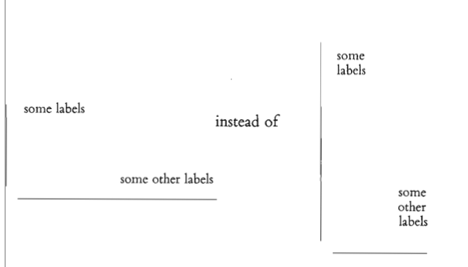
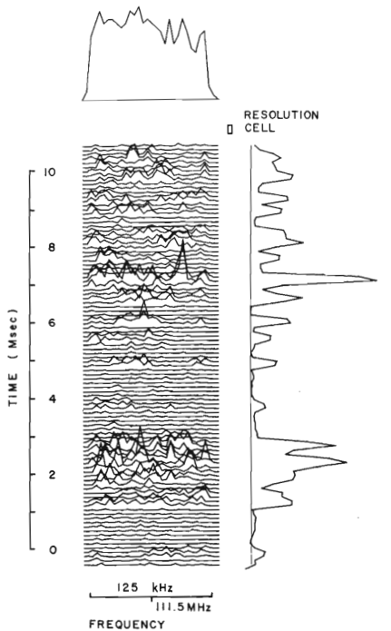
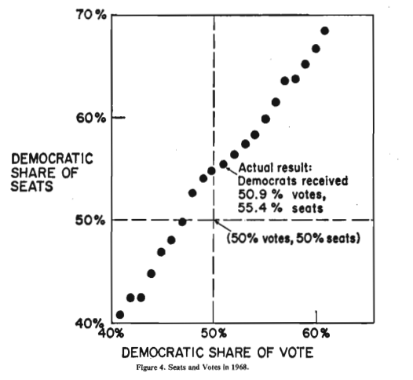
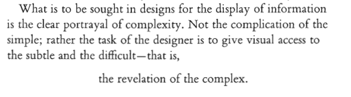
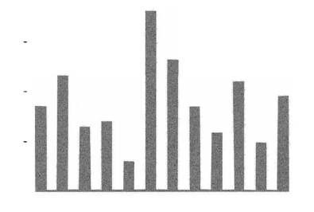
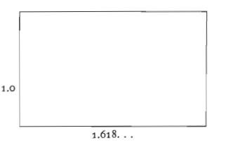

# Slide 1

Quantitative Reasoning I

Fall 2024
University of Austin  

# Slide 2

Most of the material comes from Chapters 4, 6, and 9 of  “The Visual Display of Quantitative Information” by Edward R. Tufte, 2nd Edition, Graphics Press, 2007.   
Data Ink and Graphical Redesign

Data-Ink Maximization and Graphical Design

Aesthetics and Technique in Data Graphical Design

Visual Displays – Theory of Data Graphics  

# Slide 3

Data Ink and Graphical Redesign
When designing a graph, focusing on the data-relevant information is essential.

The main goal is to reason about quantitative information.   Main Principle: “Show The Data”. 

 

 

# Slide 4

Data Ink and Graphical Redesign
 

# Slide 5

Data Ink and Graphical Redesign
Example: Electroencephalogram where all lines are relevant. 

 

 

# Slide 6

Data Ink and Graphical Redesign
Another example where almost all ink is showing relevant information:  

 

# Slide 7

Data Ink and Graphical Redesign
Principle of graphic design: Maximize the Data-Ink ratio (within reason).   

 

# Slide 8

Data Ink and Graphical Redesign
Another principle: Erase Non-Data Ink  (within reason).

Examples:  

 

# Slide 9

Data Ink and Graphical Redesign
Bilateral symmetry creates redundancy…. ??
In some cases, it may be a good idea to maintain symmetry to avoid confusion. 

Examples:  

 

# Slide 10

Data Ink and Graphical Redesign
A general principle is to “Erase Redundant Data-Ink”. 

However, redundancy is sometimes necessary to give a better perspective on patterns and cycles.  

Example:  Ocean currents around the world. 

 
One time around the world. 
One and two third times around the world. 

# Slide 11

Data Ink and Graphical Redesign
It is a good idea to edit and redesign to minimize redundant, non-data information.  

 
Example: 

# Slide 12

Data Ink and Graphical Redesign

 
Another example: 
The grid can be removed

# Slide 13

Data Ink and Graphical Redesign

 
Data-ink ratio is now ~ 0.9

A pattern not seen before.

# Slide 14

Data Ink and Graphical Redesign

 
Labels improve readability: 

# Slide 15

Conclusion

 
Principles to remember: 

Show data-related information

Maximize data-ink ratio

Erase non-relevant data

Erase redundancies

Practice the idea of editing and revisiting. 

In all these principles,
use your criteria. 

# Slide 16

Most of the material comes from Chapters 4, 6, and 9 of  “The Visual Display of Quantitative Information” by Edward R. Tufte, 2nd Edition, Graphics Press, 2007.   
Data Ink and Graphical Redesign

Data-Ink Maximization and Graphical Design

Aesthetics and Technique in Data Graphical Design

Visual Displays – Theory of Data Graphics  

# Slide 17

Data Ink Maximization and Graphical Design
It is allowed to apply the principles of graphical design to generate NEW designs.

The main idea is to focus on what matters and to eliminate what is irrelevant. 

That may lead to new designs.  

 

 
Typical box plot
It can be simplified by eliminating lines: 

# Slide 18

Data Ink Maximization and Graphical Design
Typical box plot
It can be simplified by eliminating lines: 
Preferred from of quartile plot: 
The middle part is offset.
Effective use of ink.  

# Slide 19

Data Ink Maximization and Graphical Design
Another example:
Revised version: 
This is beneficial for exploratory data analysis.
Some patterns are more straightforward to observe in the new version.

# Slide 20

Data Ink Maximization and Graphical Design
The Bar Chart:
Revised version 1: 
Revised version 2: 
The box and vertical line are erased.  

# Slide 21

Data Ink Maximization and Graphical Design
The Bar Chart:
Revised version 3: 
Coordinate lines are easier to follow.  

# Slide 22

Data Ink Maximization and Graphical Design
Another example with a variable-width box plot: 
Revised version: 
Eliminate:

Frame,
Vertical axis, 
Ticks,
Grid.   

# Slide 23

Data Ink Maximization and Graphical Design
A classic example is that of the bivariate scatter plot.  
The principles of graphical design suggest the following:
Frame lines should extend only along the data range. 
A Range Frame. Data-ink ratio increases. 

# Slide 24

Data Ink Maximization and Graphical Design
An example of a well–designed range frame :

# Slide 25

Data Ink Maximization and Graphical Design
Look at this graph showing marginal distributions 
(an excellent graphic design): 

                               Signals from pulsars

# Slide 26

Conclusions
Graphical design eliminates unnecessary information. 

It adds new ideas to maximize efficiency (leading to new designs). 

Data-Ink ratio should be close to 1.0

Efficiency should be gained in communication and production.

Consider that some designs may be hard to understand. 
     Use your criteria to decide how to present a graph according to the audience. 

# Slide 27

Most of the material comes from Chapters 4, 6, and 9 of  “The Visual Display of Quantitative Information” by Edward R. Tufte, 2nd Edition, Graphics Press, 2007.   
Data Ink and Graphical Redesign

Data-Ink Maximization and Graphical Design

Aesthetics and Technique in Data Graphical Design

Visual Displays – Theory of Data Graphics  

# Slide 28

Aesthetics and Technique in Data Graphical Design

 

 
Graphical design should look for elegance and simplicity.

This is particularly important when the data is complex. 

Guidelines:
Combine words, numbers and graph together
Provide a story behind the data. 
The design should avoid irrelevant information and be done professionally. 

# Slide 29

Aesthetics and Technique in Data Graphical Design

 

 
It is a good idea to combine graphical elements.

Example: Words and Table:

Tables: 

Ideal for small datasets. 
To be preferred to pie charts.    

# Slide 30

Aesthetics and Technique in Data Graphical Design

 

 
An example of a combination 
of words and graphs: 

Predictions above expectation    
Predictions below expectation    

# Slide 31

Aesthetics and Technique in Data Graphical Design

 

 
Words and pictures BELONG together. 

Words add helpful information, giving meaning 
to the graph elements.  

A manuscript of Leonardo DaVinci    
Tables and graphics should run into the text.

Avoid the typical “see Figure 1 for an example…”.   

# Slide 32

Aesthetics and Technique in Data Graphical Design

 

 
Friendly Graphs: 

Words are clear and informative (avoid abbreviations).

Words should be read left to right (not vertically).

Avoid legends or elaborated colors. Put clear labels.  

Graph is attractive. 

Use a few colors (clearly distinguishable). 

Type clearly and precisely (avoid all capitals).  

# Slide 33

Aesthetics and Technique in Data Graphical Design

 

 
There must be a sense of balance and proportion:

# Slide 34

Aesthetics and Technique in Data Graphical Design

 

 
Lines can be shown with different weights. 
The heavier line should correspond to the actual measurement. 

# Slide 35

Aesthetics and Technique in Data Graphical Design

 

 
Graphs should tend toward the horizontal direction (wider not longer). 
This is because humans process information in the horizontal direction. 
An ideal example is the Golden Rectangle.  

# Slide 36

Aesthetics and Technique in Data Graphical Design

 

 
Labeling should also tend toward the horizontal line.  

# Slide 37

 

 
Quote from Chapter 9, page 191,  of  “The Visual Display of Quantitative Information” by Edward R. Tufte, 2nd Edition, Graphics Press, 2007.   

