# Visual Displays – Theory of Data Graphics 
-   Data Ink and Graphical Redesign

-   Data-Ink Maximization and Graphical Design

-   Aesthetics and Technique in Data Graphical Design

# Data Ink and Graphical Redesign
- When designing a graph, focusing on the data-relevant information is essential.
\pause
- Main Goal: Reason about quantitative information. 
\pause
- Main Principle: Show the data.

# Data Ink and Graphical Redesign
\centering
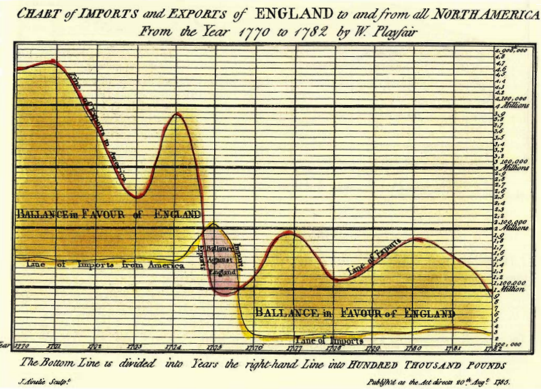{width=80%}

# Data Ink and Graphical Redesign
\centering
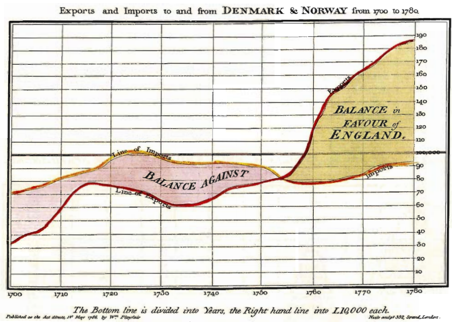{width=80%}

# Data Ink and Graphical Redesign
\begin{center}
  DIR = (amount of data-ink) / (total ink in the graph)
\end{center}

# Data Ink and Graphical Redesign
\begin{flushleft}
Example: Electroencephalogram where all lines are relevant. 
\end{flushleft}

\centering
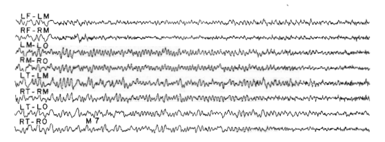{width=80%}

# Data Ink and Graphical Redesign
\begin{flushleft}
Another example: almost all ink shows relevant information
\end{flushleft}

\centering
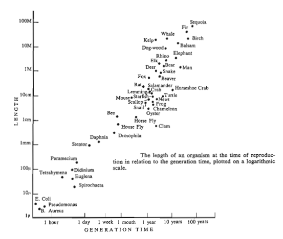{width=80%}

# Data Ink and Graphical Redesign
\begin{flushleft}
Principle of graphic design: Maximize the Data-to-Ink Ratio.
\end{flushleft}

\centering
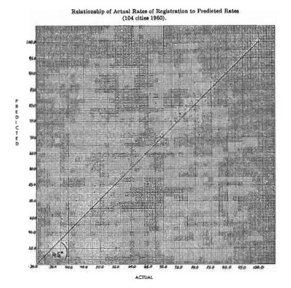{width=60%}

# Data Ink and Graphical Redesign
\begin{flushleft}
Principle of graphic design: Maximize the Data-to-Ink Ratio.
\end{flushleft}

\centering
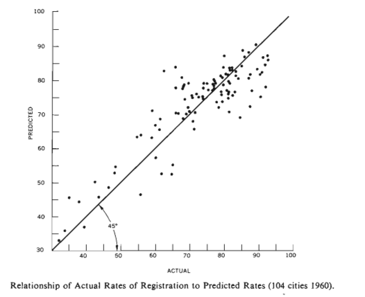{width=60%}

# Data Ink and Graphical Redesign
\begin{flushleft}
Another principle: Erase Non-Data Ink.
\end{flushleft}

\centering
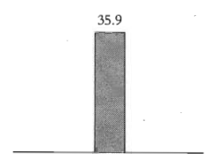{width=60%}

# Data Ink and Graphical Redesign
\begin{flushleft}
Another principle: Erase Non-Data Ink.
\end{flushleft}

\centering
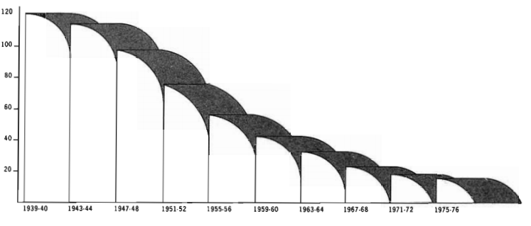{width=80%}

# Data Ink and Graphical Redesign
\begin{flushleft}
Bilateral symmetry can  redundancy.
\end{flushleft}

\centering
{width=80%}

(However, in some cases maintaining symmetry avoids confusion.)

# Data Ink and Graphical Redesign
\begin{flushleft}
Another principle: Erase Redundant Data-Ink. \\
Exception: redundancy to show patterns and cycles
\end{flushleft}

\centering
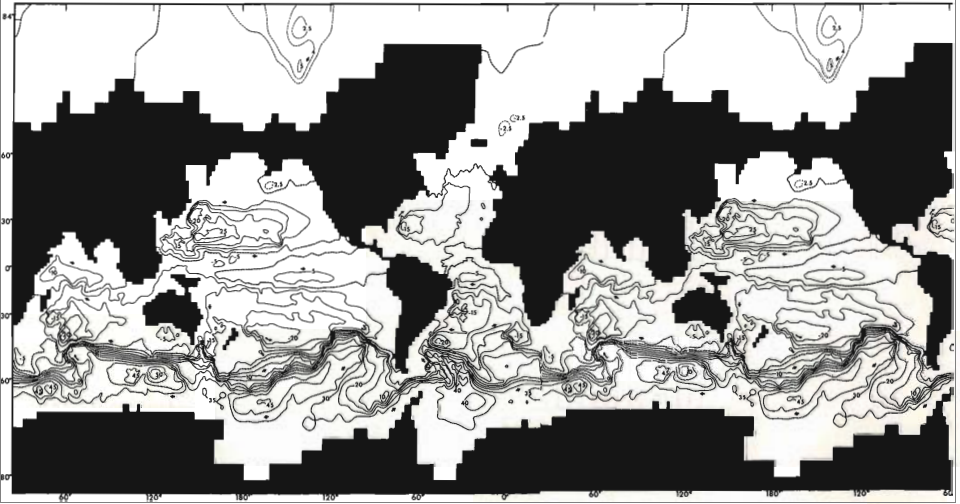{width=80%}

# Data Ink and Graphical Redesign
Edit and redesign to minimize redundant, non-data info.
\begin{columns}[c]
    \begin{column}{.5\textwidth}
    \begin{figure}
        \centering
        \includegraphics[width=0.6\textwidth]{theory_figs/image16.png}
    \end{figure}      
    \end{column}
    \pause
    \begin{column}{.5\textwidth}
    \begin{figure}
        \centering
        \includegraphics[width=0.8\textwidth]{theory_figs/image8.png}
    \end{figure}      
    \end{column}
\end{columns}

# Data Ink and Graphical Redesign
\centering
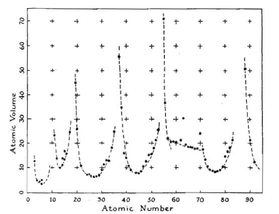{width=80%}

# Data Ink and Graphical Redesign
\centering
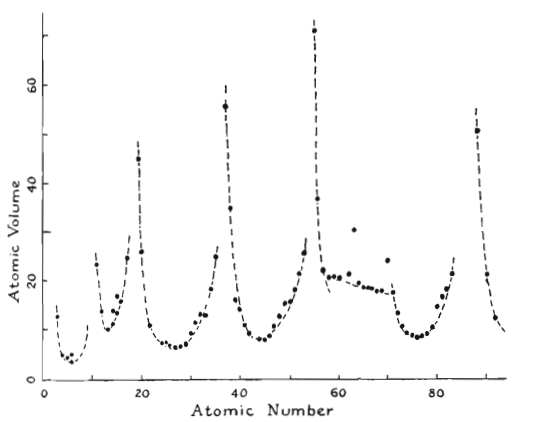{width=80%}

# Data Ink and Graphical Redesign
\centering
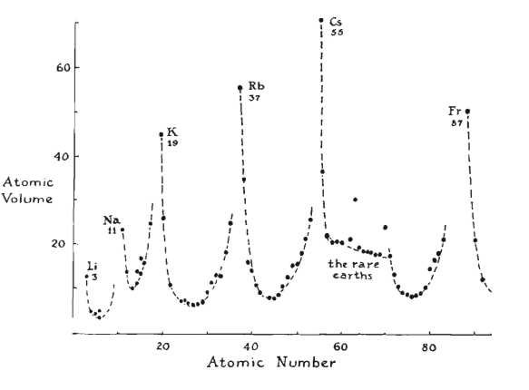{width=80%}

# Conclusion

Principles to remember: 

- Show data-related information

- Maximize data-ink ratio

- Erase non-relevant data

- Erase redundancies

- Practice the idea of editing and revisiting. 

# Data Ink Maximization and Graphical Design
\begin{flushleft}
Consider applying these principles to NEW designs.
\end{flushleft}

\centering
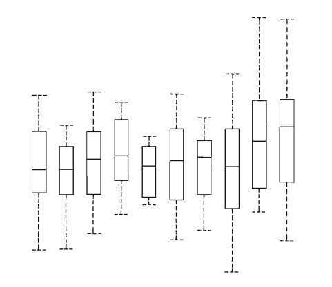{width=70%}

# Data Ink Maximization and Graphical Design
\centering
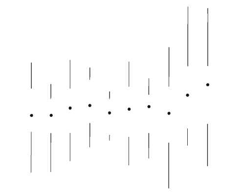{width=70%}

# Data Ink Maximization and Graphical Design
\centering
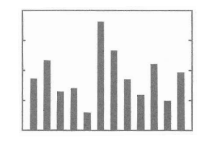{width=70%}

# Data Ink Maximization and Graphical Design
\centering
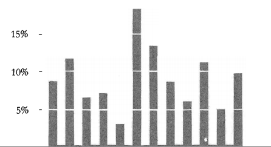{width=70%}

# Data Ink Maximization and Graphical Design
\centering
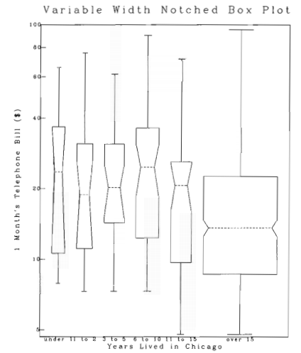{width=50%}

# Data Ink Maximization and Graphical Design
\centering
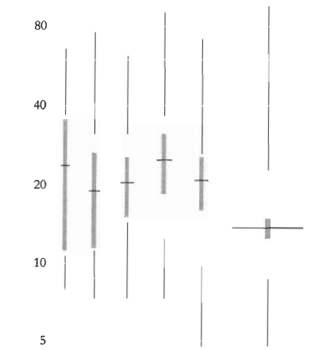{width=50%}

# Data Ink Maximization and Graphical Design
\centering
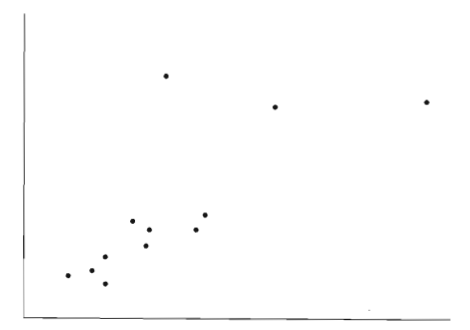{width=70%}

# Data Ink Maximization and Graphical Design
\centering
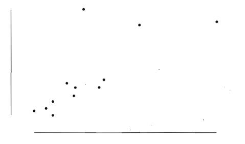{width=70%}

# Data Ink Maximization and Graphical Design
\centering
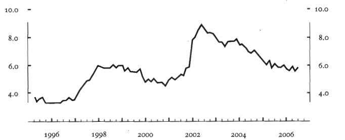{width=70%}

# Conclusions
- Graphical design eliminates unnecessary information. 

- It adds new ideas to maximize efficiency (leading to new designs). 

- Data-Ink ratio should be close to 1.

- Efficiency should be gained in communication and production.

- Consider that some designs may be hard to understand. 

- Use your criteria to decide how to present a graph according to the audience. 

# Aesthetics and Technique in Data Graphical Design
Graphical design should look for elegance and simplicity.

This is particularly important when the data are complex.  

Guidelines:

- Combine words, numbers and graph together.

- Provide a story behind the data. 

- The design should avoid irrelevant information and be done professionally. 

# Aesthetics and Technique in Data Graphical Design

Combine graphical elements when appropriate.
\pause

\begin{columns}[c]
    \begin{column}{.5\textwidth}
    \begin{figure}
        \centering
        \includegraphics[width=0.8\textwidth]{theory_figs/image32.png}
        \includegraphics[width=0.2\textwidth]{theory_figs/image1.png}
    \end{figure}      
    \end{column}
    \pause
    \begin{column}{.5\textwidth}
    \begin{figure}
        \centering
        \includegraphics[width=0.8\textwidth]{theory_figs/image34.png}        \includegraphics[width=0.2\textwidth]{theory_figs/image36.png}
    \end{figure}      
    \end{column}
\end{columns}
\pause

Tables are:

- ideal for small datasets. 

- preferable to pie charts.

# Aesthetics and Technique in Data Graphical Design
\centering
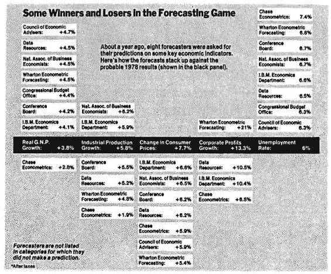{width=70%}

# Aesthetics and Technique in Data Graphical Design
\centering
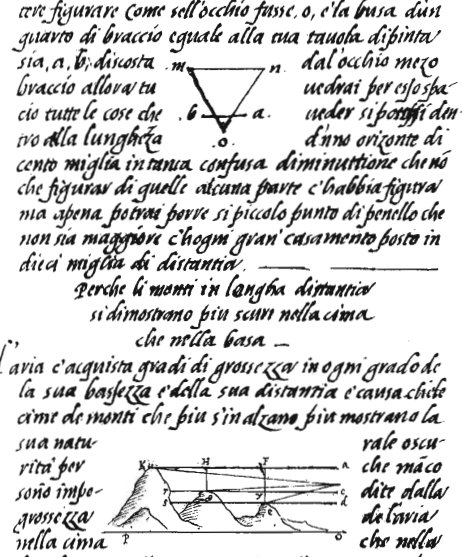{width=60%}

# Aesthetics and Technique in Data Graphical Design
Friendly Graphs: 

- Words are clear and informative (avoid abbreviations).

- Words should be read left to right (not vertically).

- Avoid legends or elaborated colors. Put clear labels.  

- Graph is attractive. 

- Use a few colors (clearly distinguishable). 

- Type clearly and precisely (avoid all capitals). 

# Aesthetics and Technique in Data Graphical Design
There should be a sense of balance and proportion.
\pause

\centering
{width=70%}

# Aesthetics and Technique in Data Graphical Design

\centering
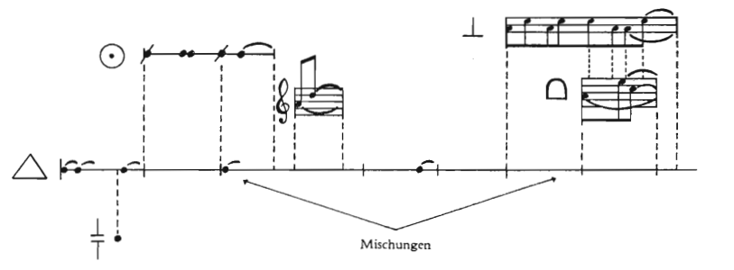{width=90%}

# Aesthetics and Technique in Data Graphical Design
\begin{flushleft}
Graphs should tend toward the horizontal direction (wider not longer), because humans process information in the horizontal direction.
\end{flushleft}

\centering
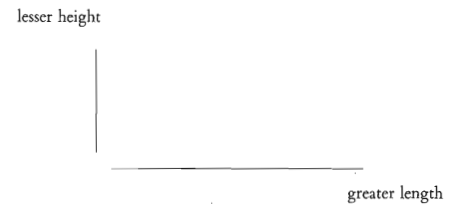{width=70%}

# Aesthetics and Technique in Data Graphical Design
\begin{flushleft}
An ideal example is the Golden Rectangle:
\end{flushleft}

\centering
{width=70%}

# Aesthetics and Technique in Data Graphical Design
\begin{flushleft}
Labeling should also tend toward the horizontal line:
\end{flushleft}

\centering
{width=70%}

# Epilogue
"What is to be sought in designs for the display of quantitative information is the clear portrayal of complexity.  Not the complication of the simple; rather the task of the designer is to give visual access to the subtle and the difficult -- that is,
\begin{center}
  the revelation of the complex.
\end{center}

