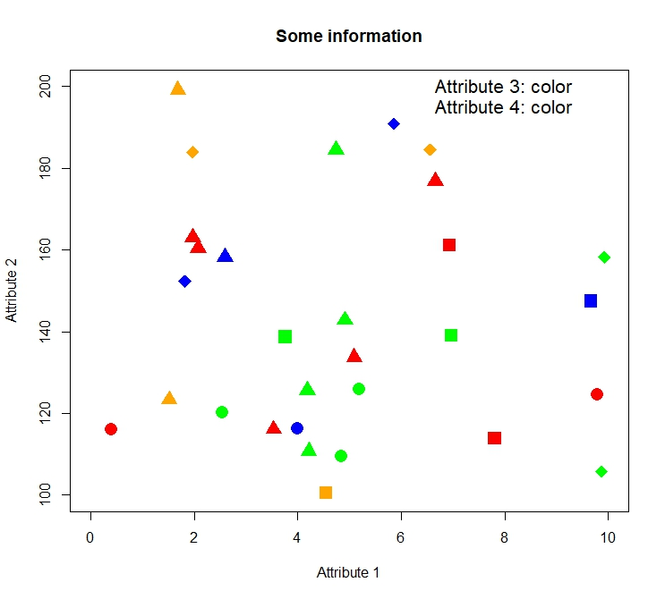
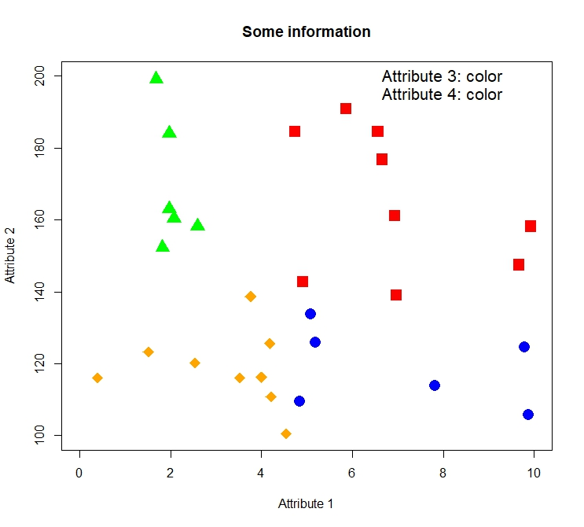
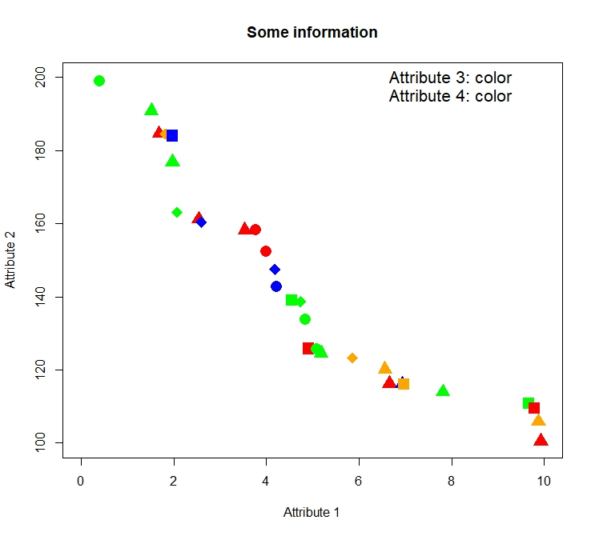
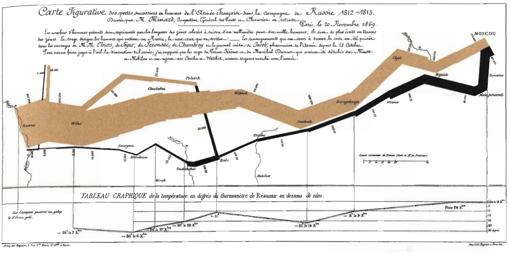

## Introduction

- About your instructors
- About the course

## Quantitative Reasoning I is...
...the first of a two-course sequence in quantitative reasoning.

Topics include interpretation of graphical information, functional notation, patterns, mathematical problem formulation.

Throughout the course examples will be drawn from a variety of fields including physics, biology, and economics; there will be particular emphasis on the laws of nature and analogies among them.

## Course administration and syllabus


## Introduction to Visual Display of Quantitative Information

\begingroup
\fontfamily{phv}\fontsize{16}{18}\selectfont
\begin{center}
  SEE TABLE HANDOUTS
\end{center}
\endgroup

## Table 1
```{r, echo=FALSE, out.width="85%", fig.cap="Data from Table 1."}

```

## Table 2
```{r, echo=FALSE, out.width="85%", fig.cap="Data from Table 2."}

```

## Table 3
```{r, echo=FALSE, out.width="85%", fig.cap="Data from Table 3."}

```

<!-- ## A famous figure (ref. Tufte p.41) -->
<!-- ```{r, echo=FALSE, out.width="100%"} -->
<!--  -->
<!-- ``` -->