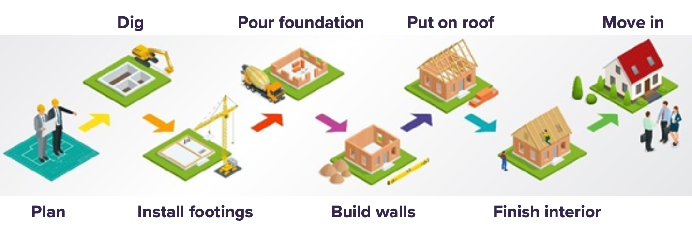

## 

\sk
\Large \dg{You are confronted with a difficult question with many moving parts and possible outcomes.}

\sk\sk
How do you effectively answer this question, acknowledging the complexity, uncertainty, and trade offs involved?

##

\sk
\Large
Are medical schools discriminatory in admissions?

##

\sk
\Large
Are police racist?

##

\sk
\Large
Is private space travel the best way to become a multiplanetary species?

##

\sk
\Large
Is the stock market predictable, and if so, to what degree?

##

\sk
\Large
Will increasing the minimum wage help or hurt the economy?

##

\sk
\Large
Is this vaccine safe and effective?

##

\sk
\Large
Should I propose to a fellow UATX student?

##

\sk
\Large
Should I \st{propose to} ask out a fellow UATX student?

## An analogy: Building a house

	
\sk	
There's only one way to manage something so complex:

- \bo{Break down} the complex task into simpler tasks 
- \bo{Sequence} the tasks so that each one builds on prior tasks and feeds into subsequent tasks

## An analogy: Building a house

A quantitative argument is built from sequencing simpler tasks

- \bo{Framing} the question
- Building a \bo{model}
- Gathering \bo{data}
- Making defensible \bo{assumptions}
- \bo{Probing} the model's outputs

##

\sk
\Large Is college worth it?

